---
## Front matter
lang: ru-RU
title: Анализ файловой системы Linux. Команды для работы с файлами и каталогами
subtitle: Операционные Системы
author:
  - Барсегян В.Л.
institute:
  - Российский университет дружбы народов, Москва, Россия
date: 11.03.2023г.

## i18n babel
babel-lang: russian
babel-otherlangs: english

## Formatting pdf
toc: false
toc-title: Содержание
slide_level: 2
aspectratio: 169
section-titles: true
theme: metropolis
header-includes:
 - \metroset{progressbar=frametitle,sectionpage=progressbar,numbering=fraction}
 - '\makeatletter'
 - '\beamer@ignorenonframefalse'
 - '\makeatother'
---

# Информация

## Докладчик

  * Барсегян Вардан Левонович
  * НПИбд-01-22
  * Российский университет дружбы народов
  * [1132222005@pfur.ru]
  * <https://github.com/VARdamn/study_2022-2023_os-intro>

# Вводная часть

## Цели и задачи

Ознакомление с файловой системой Linux, её структурой, именами и содержанием
каталогов. Приобретение практических навыков по применению команд для работы
с файлами и каталогами, по управлению процессами (и работами), по проверке использования диска и обслуживанию файловой системы.

## Задачи

1. Выполните все примеры, приведённые в первой части описания лабораторной работы.
2. Выполните следующие действия, зафиксировав в отчёте по лабораторной работе используемые при этом команды и результаты их выполнения:
2.1. Скопируйте файл /usr/include/sys/io.h в домашний каталог и назовите его equipment. Если файла io.h нет, то используйте любой другой файл в каталоге /usr/include/sys/ вместо него.
2.2. В домашнем каталоге создайте директорию ~/ski.plases.
2.3. Переместите файл equipment в каталог ~/ski.plases.
2.4. Переименуйте файл ~/ski.plases/equipment в ~/ski.plases/equiplist.
2.5. Создайте в домашнем каталоге файл abc1 и скопируйте его в каталог ~/ski.plases, назовите его equiplist2.
2.6. Создайте каталог с именем equipment в каталоге ~/ski.plases.
2.7. Переместите файлы ~/ski.plases/equiplist и equiplist2 в каталог ~/ski.plases/equipment.
2.8. Создайте и переместите каталог ~/newdir в каталог ~/ski.plases и назовите его plans.
3. Определите опции команды chmod, необходимые для того, чтобы присвоить перечисленным ниже файлам выделенные права доступа, считая, что в начале таких прав нет:
3.1. drwxr--r-- ... australia
3.2. drwx--x--x ... play
3.3. -r-xr--r-- ... my_os
3.4. -rw-rw-r-- ... feathers
При необходимости создайте нужные файлы.
4. Проделайте приведённые ниже упражнения, записывая в отчёт по лабораторной
работе используемые при этом команды:
4.1. Просмотрите содержимое файла /etc/password.
4.2. Скопируйте файл ~/feathers в файл ~/file.old.
4.3. Переместите файл ~/file.old в каталог ~/play.
4.4. Скопируйте каталог ~/play в каталог ~/fun.
4.5. Переместите каталог ~/fun в каталог ~/play и назовите его games.
4.6. Лишите владельца файла ~/feathers права на чтение.
4.7. Что произойдёт, если вы попытаетесь просмотреть файл ~/feathers командой cat?
4.8. Что произойдёт, если вы попытаетесь скопировать файл ~/feathers?
4.9. Дайте владельцу файла ~/feathers право на чтение.
4.10. Лишите владельца каталога ~/play права на выполнение.
4.11. Перейдите в каталог ~/play. Что произошло?
4.12. Дайте владельцу каталога ~/play право на выполнение.
5. Прочитайте man по командам mount, fsck, mkfs, kill и кратко их охарактеризуйте,
приведя примеры.

# Выполнение лабораторной работы

## Выполнение п. 1

Создаю текстовый файл с помощью команды *touch* и просматриваю его

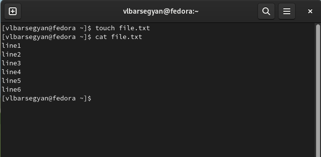{#fig:001 width=45%}

## Выполнение п. 1

Просматриваю файл постранично с помощью команды *less*

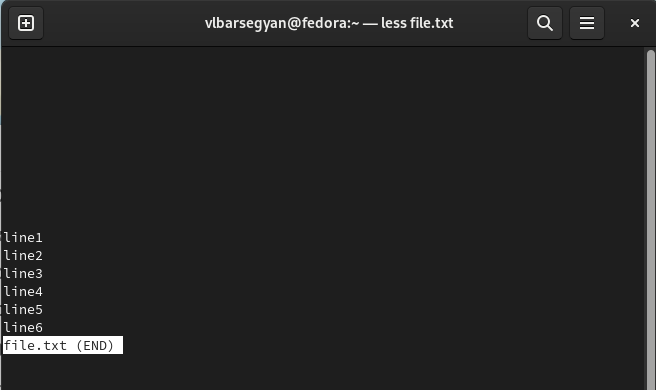{#fig:002 width=45%}

## Выполнение п. 1

Просматриваю файл, задавая количество строк с начала (команда head), и задавая количество просматриваемых строк с конца (команда tail)

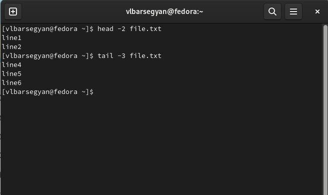{#fig:003 width=45%}

## Выполнение п. 1

Создаю файл abc1 и копирую его в файлы april, may

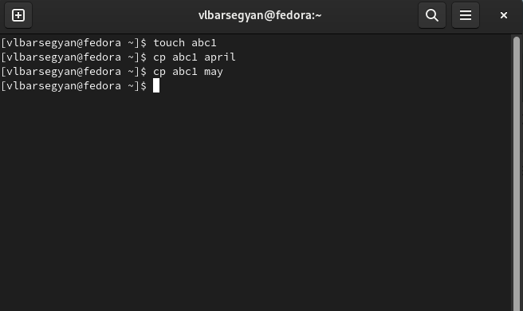{#fig:004 width=45%}

## Выполнение п. 1

Создаю каталог monthly и копирую в него в файлы april, may

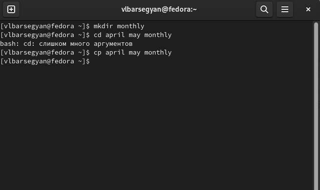{#fig:005 width=45%}

## Выполнение п. 1

Копирую файл monthly/may в файл monthly/june и проверяю

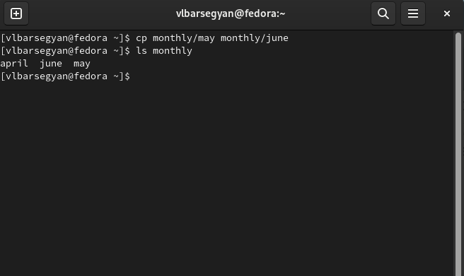{#fig:006 width=45%}

## Выполнение п. 1

Рекурсивно копирую каталог monthly в каталог monthly.00

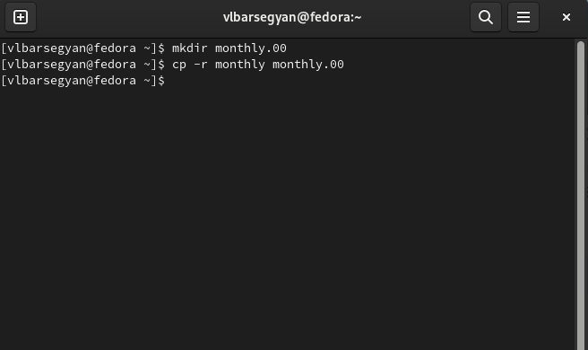{#fig:007 width=45%}

## Выполнение п. 1

Копирую каталог monthly.00 в каталог /tmp

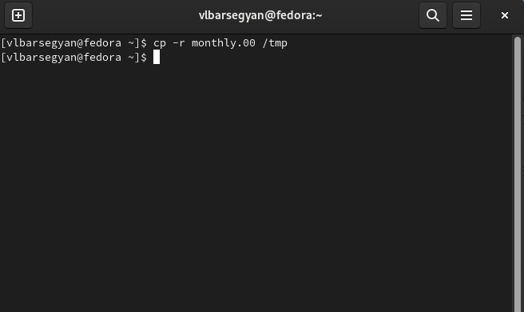{#fig:008 width=45%}

## Выполнение п. 1

Изменяю название файла april на july в домашнем каталоге

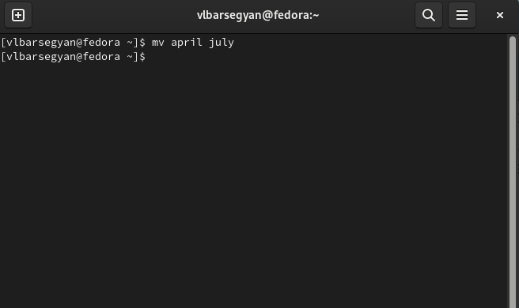{#fig:009 width=45%}

## Выполнение п. 1

Перемещаю файл july в каталог monthly.00, проверяю

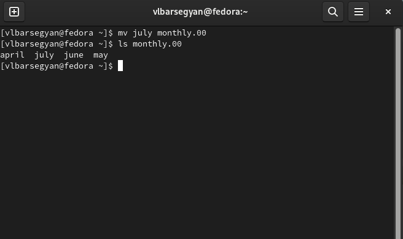{#fig:010 width=45%}

## Выполнение п. 1

Переименовываю каталог monthly.00 в monthly.01

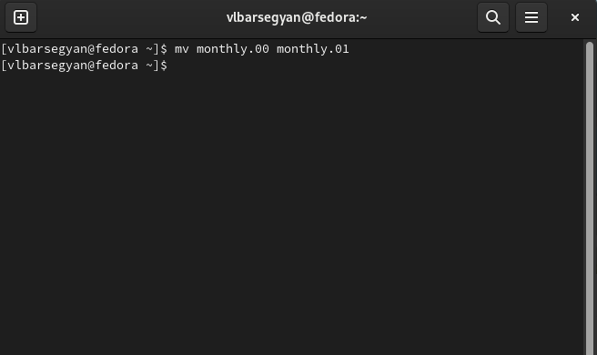{#fig:011 width=45%}

## Выполнение п. 1

Создаю каталог reports и перемещаю каталог monthly.01 в каталог reports

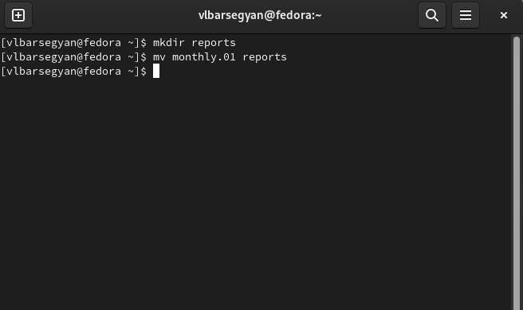{#fig:012 width=45%}

## Выполнение п. 1

Меняю название каталога reports/monthly.01 на reports/monthly

{#fig:013 width=45%}

## Выполнение п. 1

Создаю файл may, меняю права доступа (добавляю возможноость исполнения файла для владельца), проверяю права доступа файла до и после изменений

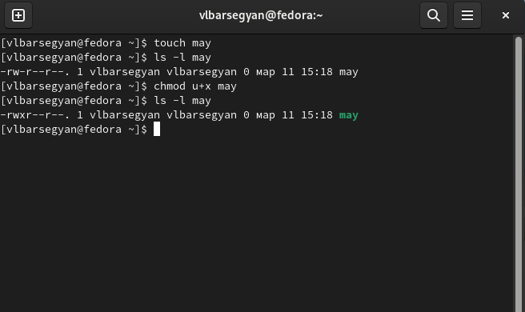{#fig:014 width=45%}

## Выполнение п. 1

Убираю у владельца файла ~/may права на выполнение с помощью команды *сhmod* и проверяю

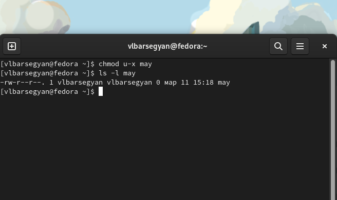{#fig:015 width=45%}

## Выполнение п. 1

Создаю каталог monthly, запрещаю чтение для членов группы и всех
остальных пользователей

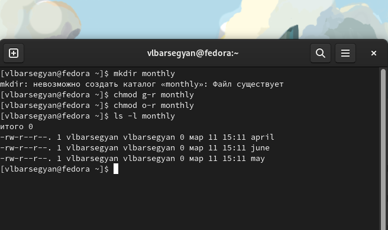{#fig:016 width=45%}

## Выполнение п. 1

Создаю файл ~/abc1, добавляю право записи для членов группы

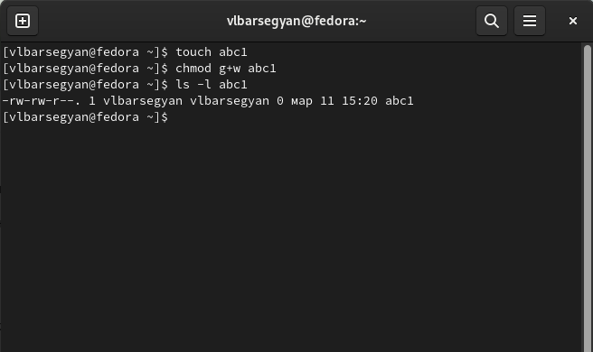{#fig:017 width=45%}

## Выполнение п. 1

Использую команду mount для просмотра используемых в операционной системе файловых систем

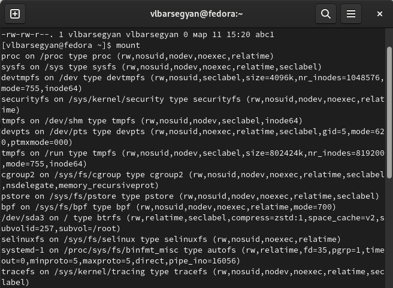{#fig:018 width=45%}

## Выполнение п. 1

Определяю смонтированных в операционной системе файловых систем, просматривая файл /etc/fstab (команда cat /etc/fstab)

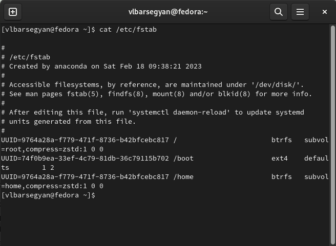{#fig:019 width=45%}

## Выполнение п. 1

Проверяю целостность файловой системы с помощью команды *fsck*. Использую ее от суперпользователя, т.к. иначе доступа к этим файлам получить нельзя.

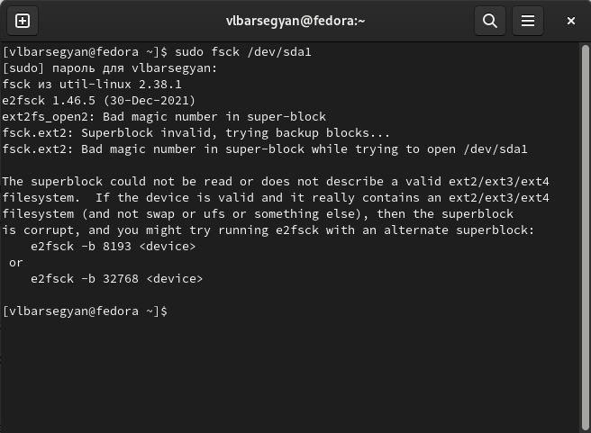{#fig:020 width=45%}

## Выполнение п. 2.1

Копирую файл /usr/include/sys/io.h в домашний каталог и называю его equipment

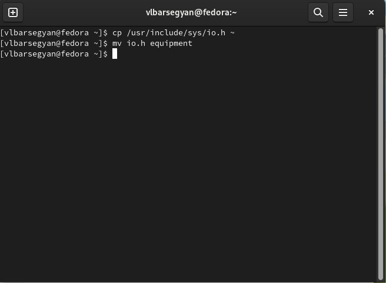{#fig:021 width=45%}

## Выполнение пп. 2.2-2.4 

Создаю директорию ~/ski.plases, перемещаю файл equipment в каталог ~/ski.plases и переименовываю файл ~/ski.plases/equipment в ~/ski.plases/equiplist

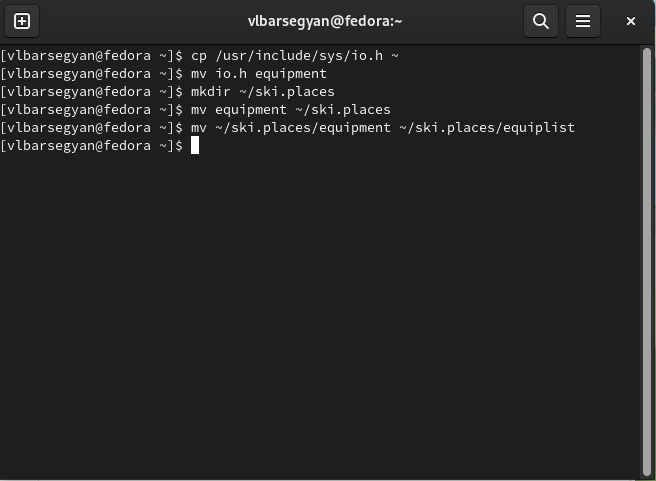{#fig:022 width=45%}

## Выполнение п. 2.5 

Создаю файл abc1, копирую его в каталог ~/ski.plases, называю equiplist2

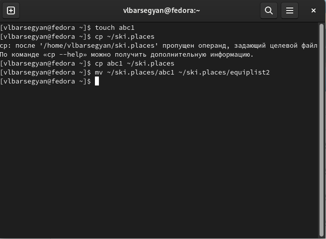{#fig:023 width=45%}

## Выполнение пп. 2.6-2.7 

Создаю каталог с именем equipment в каталоге ~/ski.plases, перемещаю файлы ~/ski.plases/equiplist и equiplist2 в каталог ~/ski.plases/equipment

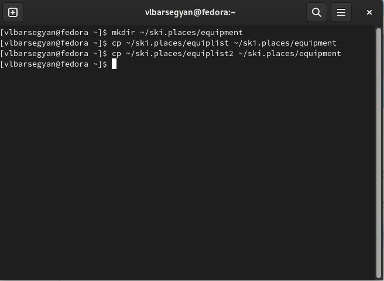{#fig:024 width=45%}

## Выполнение п. 2.8

Создаю и перемещаю каталог ~/newdir в каталог ~/ski.plases и называю его plans

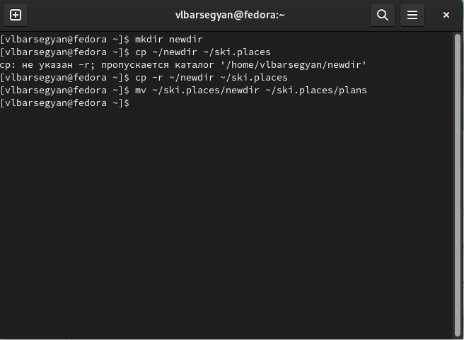{#fig:025 width=45%} 

## Выполнение п. 3

Создаю каталоги australia, play и файлы my_os, feathers. Проверяю их права доступа до изменений

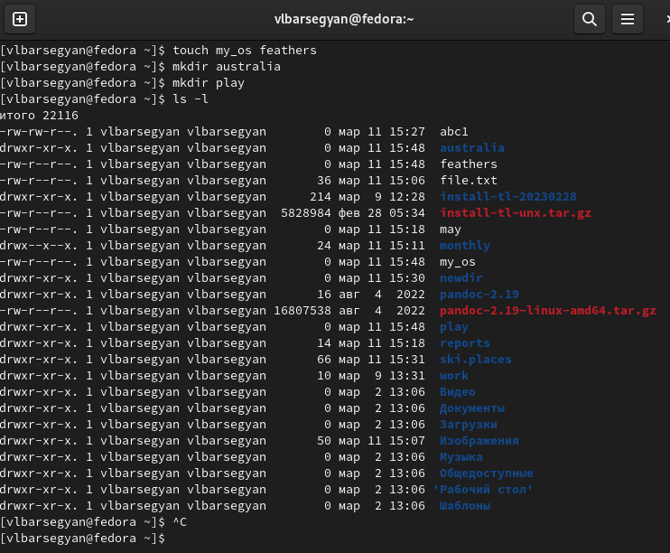{#fig:026 width=45%} 

## Выполнение п. 3 

С помощью команды chmod изменяю права доступа этим файлам и каталогам следующим образом

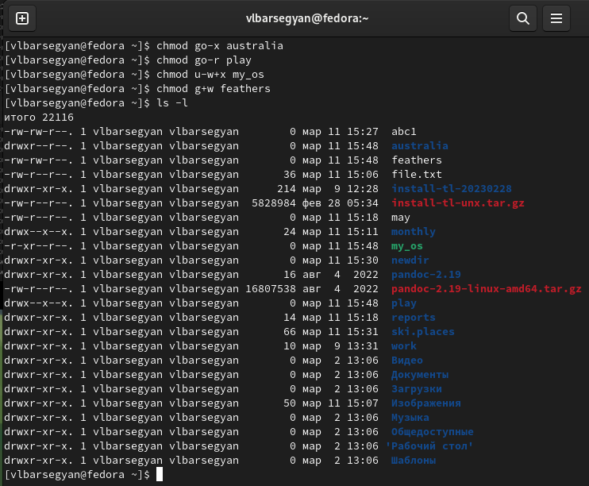{#fig:027 width=45%} 

## Выполнение п. 4.1

Просматриваю содержимое файла /etc/passwd с помощью команды cat

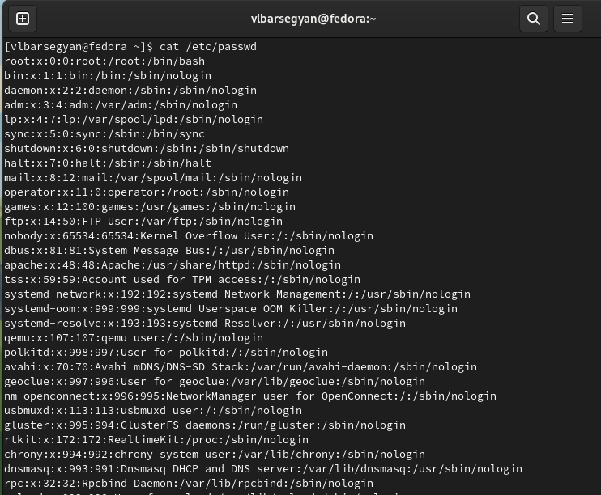{#fig:028 width=45%} 

## Выполнение пп. 4.2-4.4

Копирую файл ~/feathers в файл ~/file.old (команда cp), перемещаю файл ~/file.old в каталог ~/play (команда mv), копирую каталог ~/play в каталог ~/fun (команда cp)

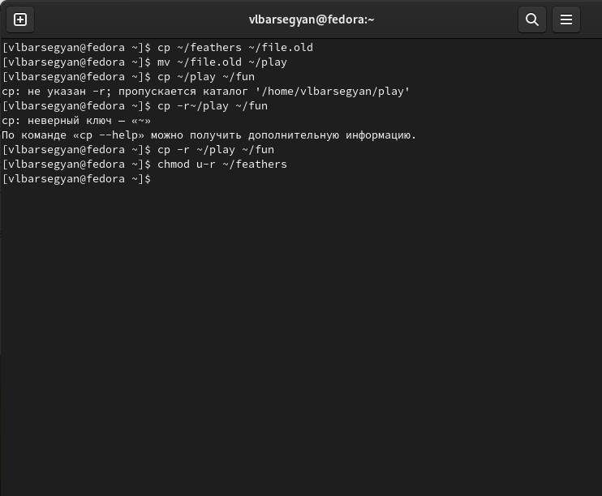{#fig:029 width=45%} 

## Выполнение п. 4.5

Перемещаю каталог ~/fun в каталог ~/play (команда mv) и называю его games (команда mv)
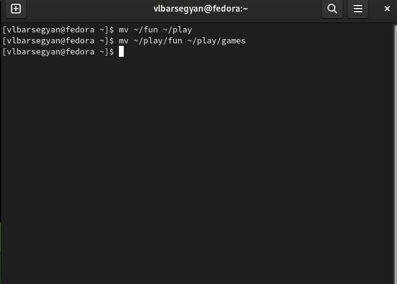{#fig:036 width=45%} 

## Выполнение п. 4.6

Лишаю владельца файла ~/feathers права на чтение командой сhmod u-r ~/feathers.

{#fig:029 width=45%} 

## Выполнение пп. 4.7-4.9

Пытаюсь просмотреть файл командой cat и получаю сообщение "отказано в доступе", т.к. были убраны права на чтение. Аналогично при попытке копирования файла командой ср отказано в доступе. Даю владельцу файла ~/feathers право на чтение командой chmod u+r ~/feathers, проверяю и теперь можно открывать и копировать эьтот файл.

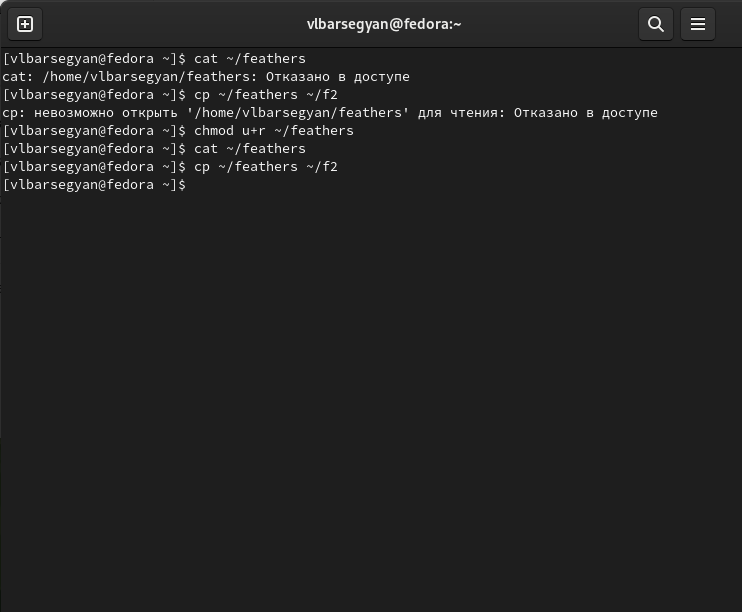{#fig:030 width=38%} 

## Выполнение пп. 4.10-4.12

Лишаю владельца каталога ~/play права на выполнение командой chmod u-x. При попытке перейти в каталог возникает исключение "отказано в доступе". Возвращаю владельцу права на выполнение командой chmod u+x и после этого в каталог можно перейти.

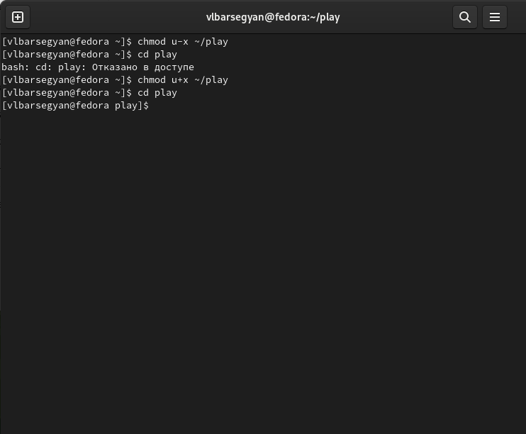{#fig:031 width=38%} 

## Выполнение п. 5 

Читаю man по команде mount. Команда mount используется для просмотра используемых в ОС файловых систем

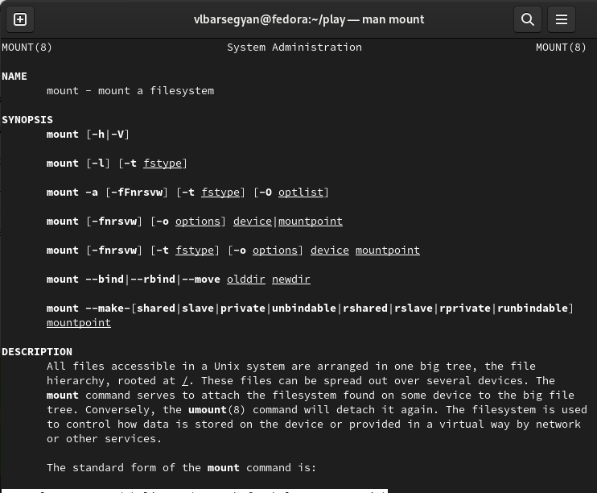{#fig:032 width=40%} 

## Выполнение п. 5 

Читаю man по команде fsck. Команда fsck используется для проверки (а иногда восстановления) целостности файловой системы

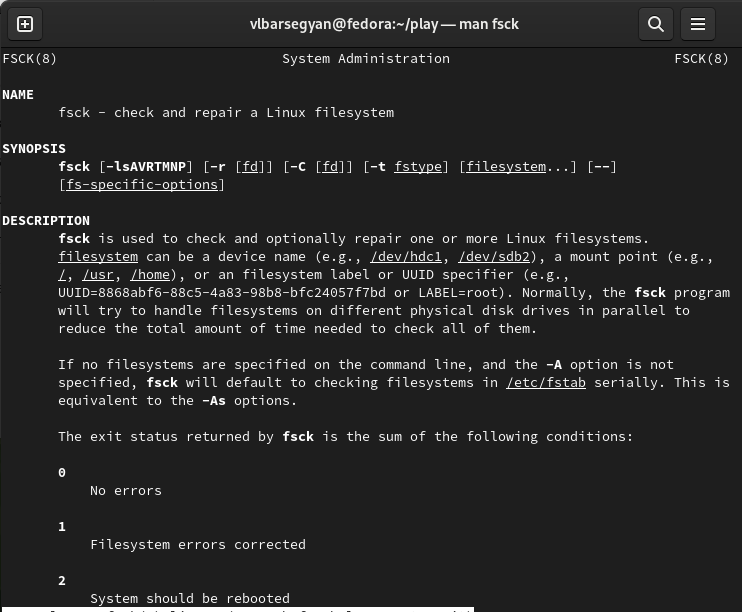{#fig:033 width=45%} 

## Выполнение п. 5 

Читаю man по команде mkfs. Команда mkfs используется для создания файловой системы Линукс на устройстве, обычно в разделе жесткого диска. В качестве аргумента может выступать название устройства или точка монтирования 

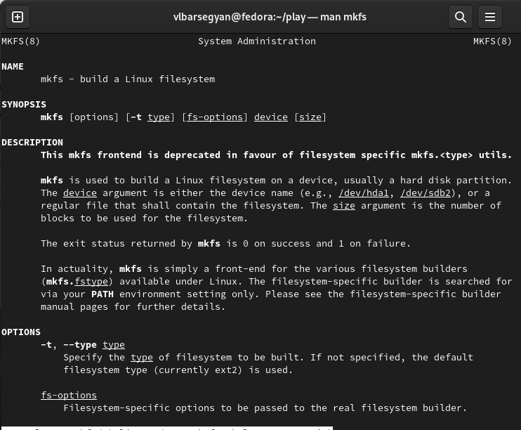{#fig:034 width=35%} 

## Выполнение п. 5 

Читаю man по команде kill. Команда kill используется для отправки сигнала процессу, указанного с помощью каждого из операндов

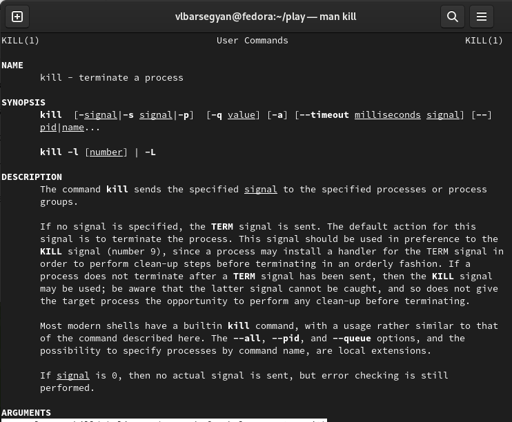{#fig:035 width=40%}

## Вывод

В ходе выполнения лабораторной работы я освоил команды для работы с файлами и каталогами, научился копировать файлы и каталоги в системе Linux, также я научился перемещать и переименовывать файлы, узнал про права доступа и их изменение для разных категорий, также я узнал про анализ файловой системы и команды для этого.

