---
## Front matter
title: "Лабораторная работа № 5"
subtitle: "Анализ файловой системы Linux. Команды для работы с файлами и каталогами"
author: "Барсегян Вардан Левонович"

## Generic otions
lang: ru-RU
toc-title: "Содержание"

## Bibliography
bibliography: bib/cite.bib
csl: pandoc/csl/gost-r-7-0-5-2008-numeric.csl

## Pdf output format
toc: true # Table of contents
toc-depth: 2
lof: true # List of figures
lot: true # List of tables
fontsize: 12pt
linestretch: 1.5
papersize: a4
documentclass: scrreprt
## I18n polyglossia
polyglossia-lang:
  name: russian
  options:
	- spelling=modern
	- babelshorthands=true
polyglossia-otherlangs:
  name: english
## I18n babel
babel-lang: russian
babel-otherlangs: english
## Fonts
mainfont: PT Serif
romanfont: PT Serif
sansfont: PT Sans
monofont: PT Mono
mainfontoptions: Ligatures=TeX
romanfontoptions: Ligatures=TeX
sansfontoptions: Ligatures=TeX,Scale=MatchLowercase
monofontoptions: Scale=MatchLowercase,Scale=0.9
## Biblatex
biblatex: true
biblio-style: "gost-numeric"
biblatexoptions:
  - parentracker=true
  - backend=biber
  - hyperref=auto
  - language=auto
  - autolang=other*
  - citestyle=gost-numeric
## Pandoc-crossref LaTeX customization
figureTitle: "Рис."
tableTitle: "Таблица"
listingTitle: "Листинг"
lofTitle: "Список иллюстраций"
lotTitle: "Список таблиц"
lolTitle: "Листинги"
## Misc options
indent: true
header-includes:
  - \usepackage{indentfirst}
  - \usepackage{float} # keep figures where there are in the text
  - \floatplacement{figure}{H} # keep figures where there are in the text
---

# Цель работы

Ознакомление с файловой системой Linux, её структурой, именами и содержанием
каталогов. Приобретение практических навыков по применению команд для работы
с файлами и каталогами, по управлению процессами (и работами), по проверке использования диска и обслуживанию файловой системы.

# Задание

1. Выполните все примеры, приведённые в первой части описания лабораторной работы.
2. Выполните следующие действия, зафиксировав в отчёте по лабораторной работе
используемые при этом команды и результаты их выполнения:
2.1. Скопируйте файл /usr/include/sys/io.h в домашний каталог и назовите его
equipment. Если файла io.h нет, то используйте любой другой файл в каталоге
/usr/include/sys/ вместо него.
2.2. В домашнем каталоге создайте директорию ~/ski.plases.
2.3. Переместите файл equipment в каталог ~/ski.plases.
2.4. Переименуйте файл ~/ski.plases/equipment в ~/ski.plases/equiplist.
2.5. Создайте в домашнем каталоге файл abc1 и скопируйте его в каталог
~/ski.plases, назовите его equiplist2.
2.6. Создайте каталог с именем equipment в каталоге ~/ski.plases.
2.7. Переместите файлы ~/ski.plases/equiplist и equiplist2 в каталог
~/ski.plases/equipment.
2.8. Создайте и переместите каталог ~/newdir в каталог ~/ski.plases и назовите
его plans.
3. Определите опции команды chmod, необходимые для того, чтобы присвоить перечисленным ниже файлам выделенные права доступа, считая, что в начале таких прав
нет:
3.1. drwxr--r-- ... australia
3.2. drwx--x--x ... play
3.3. -r-xr--r-- ... my_os
3.4. -rw-rw-r-- ... feathers
При необходимости создайте нужные файлы.
4. Проделайте приведённые ниже упражнения, записывая в отчёт по лабораторной
работе используемые при этом команды:
4.1. Просмотрите содержимое файла /etc/password.
4.2. Скопируйте файл ~/feathers в файл ~/file.old.
4.3. Переместите файл ~/file.old в каталог ~/play.
4.4. Скопируйте каталог ~/play в каталог ~/fun.
4.5. Переместите каталог ~/fun в каталог ~/play и назовите его games.
4.6. Лишите владельца файла ~/feathers права на чтение.
4.7. Что произойдёт, если вы попытаетесь просмотреть файл ~/feathers командой
cat?
4.8. Что произойдёт, если вы попытаетесь скопировать файл ~/feathers?
4.9. Дайте владельцу файла ~/feathers право на чтение.
4.10. Лишите владельца каталога ~/play права на выполнение.
4.11. Перейдите в каталог ~/play. Что произошло?
4.12. Дайте владельцу каталога ~/play право на выполнение.
5. Прочитайте man по командам mount, fsck, mkfs, kill и кратко их охарактеризуйте,
приведя примеры.

# Выполнение лабораторной работы

## Команды для работы с файлами и каталогами

1. Создаю текстовый файл с помощью команды *touch* и просматриваю его (рис. @fig:001).

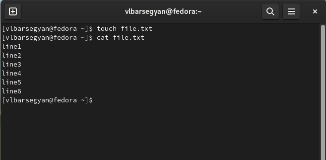{#fig:001 width=70%}

2. Просматриваю файл постранично с помощью команды *less* (рис. @fig:002).

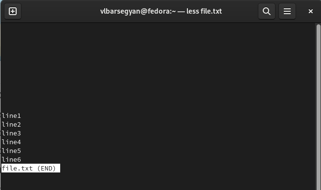{#fig:002 width=70%}

3. Просматриваю файл, задавая количество строк с начала (команда head), и задавая количество просматриваемых строк с конца (команда tail) (рис. @fig:003).

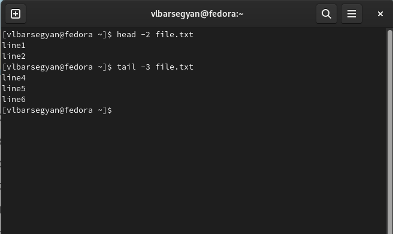{#fig:003 width=70%}

## Копирование файлов и каталогов

4. Создаю файл abc1 и копирую его в файлы april, may (рис. @fig:004).

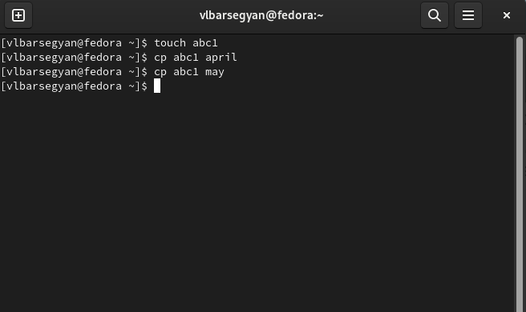{#fig:004 width=70%}

5. Создаю каталог monthly и копирую в него в файлы april, may (рис. @fig:005).

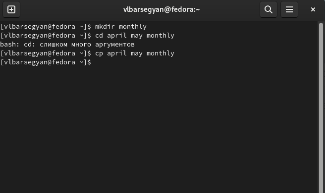{#fig:005 width=70%}

6. Копирую файл monthly/may в файл monthly/june и проверяю (рис. @fig:006).

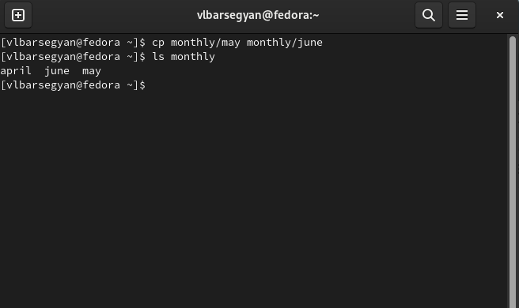{#fig:006 width=70%}

7.  Рекурсивно копирую каталог monthly в каталог monthly.00 (рис. @fig:007).

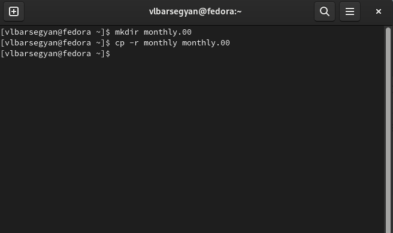{#fig:007 width=70%}

8. Копирую каталог monthly.00 в каталог /tmp (рис. @fig:008).

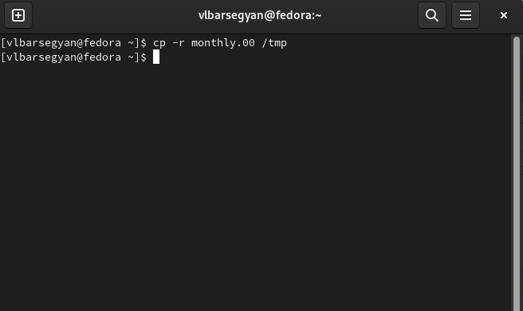{#fig:008 width=70%}

##  Перемещение и переименование файлов и каталогов

9. Изменяю название файла april на july в домашнем каталоге (рис. @fig:009).

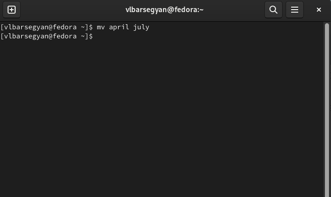{#fig:009 width=70%}

10. Перемещаю файл july в каталог monthly.00, проверяю (рис. @fig:010).

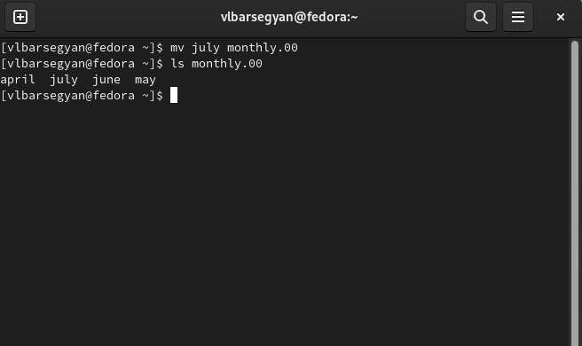{#fig:010 width=70%}

11. Переименовываю каталог monthly.00 в monthly.01 (рис. @fig:011).

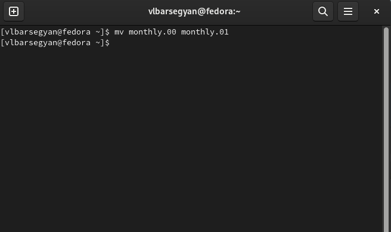{#fig:011 width=70%}

12. Создаю каталог reports и перемещаю каталог monthly.01 в каталог reports (рис. @fig:012).

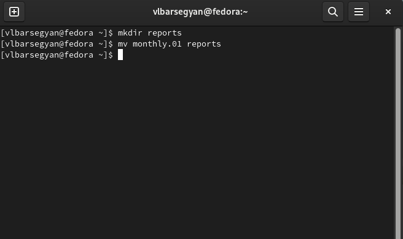{#fig:012 width=70%}

13. Меняю название каталога reports/monthly.01 на reports/monthly (рис. @fig:013).

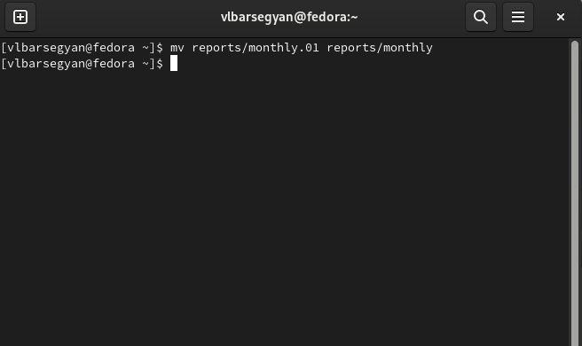{#fig:013 width=70%}

## Изменение прав доступа

14. Создаю файл may, меняю права доступа (добавляю возможноость исполнения файла для владельца), проверяю права доступа файла до и после изменений (рис. @fig:014).

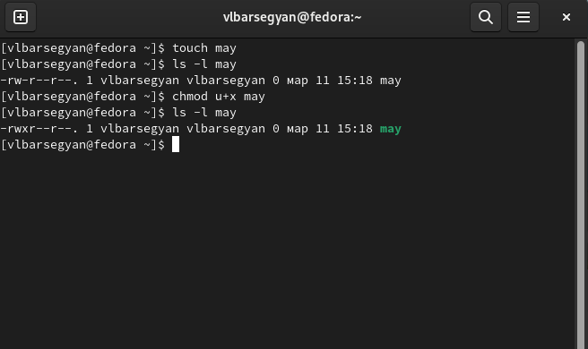{#fig:014 width=70%}

15. Убираю у владельца файла ~/may права на выполнение с помощью команды *сhmod* и проверяю (рис. @fig:015).

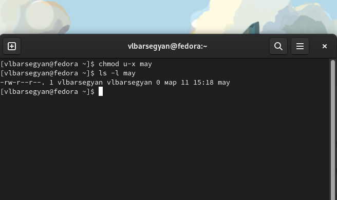{#fig:015 width=70%}

16. Создаю каталог monthly, запрещаю чтение для членов группы и всех
остальных пользователей (рис. @fig:016).

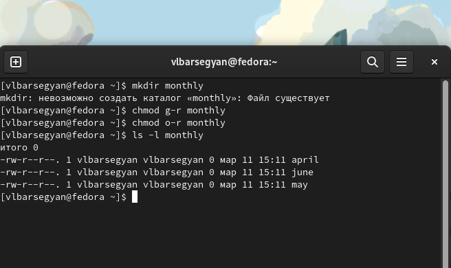{#fig:016 width=70%}

17. Создаю файл ~/abc1, добавляю право записи для членов группы (рис. @fig:017).

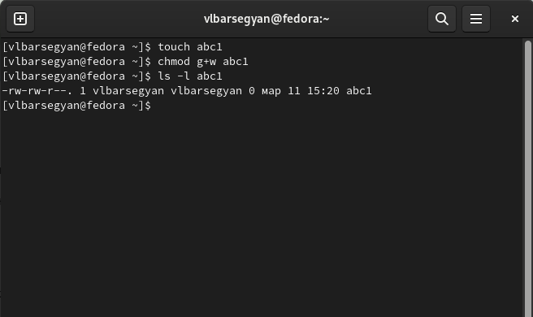{#fig:017 width=70%}

## Анализ файловой системы

18. Использую команду mount для просмотра используемых в операционной системе файловых систем (рис. @fig:018).

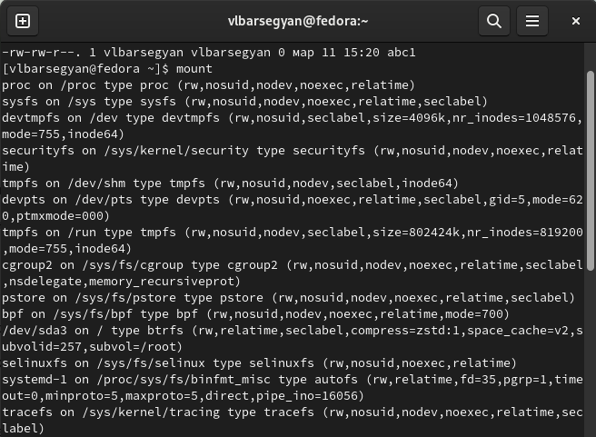{#fig:018 width=70%}

19. Определяю смонтированных в операционной системе файловых систем, просматривая файл /etc/fstab (команда cat /etc/fstab) (рис. @fig:019).

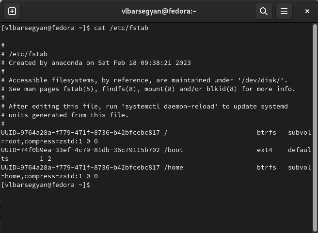{#fig:019 width=70%}

20. Проверяю целостность файловой системы с помощью команды *fsck*. Использую ее от суперпользователя, т.к. иначе доступа к этим файлам получить нельзя. (рис. @fig:020).

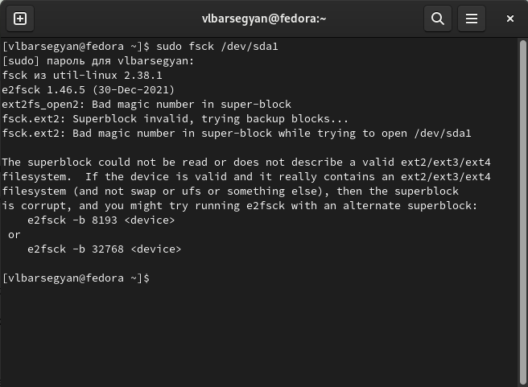{#fig:020 width=70%}

# Выполнение заданий 2-5

1. Копирую файл /usr/include/sys/io.h в домашний каталог и называю его equipment (рис. @fig:021).

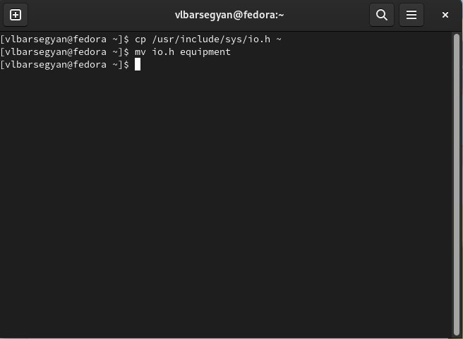{#fig:021 width=70%}

2. Создаю директорию ~/ski.plases, перемещаю файл equipment в каталог ~/ski.plases и переименовываю файл ~/ski.plases/equipment в ~/ski.plases/equiplist (рис. @fig:022).

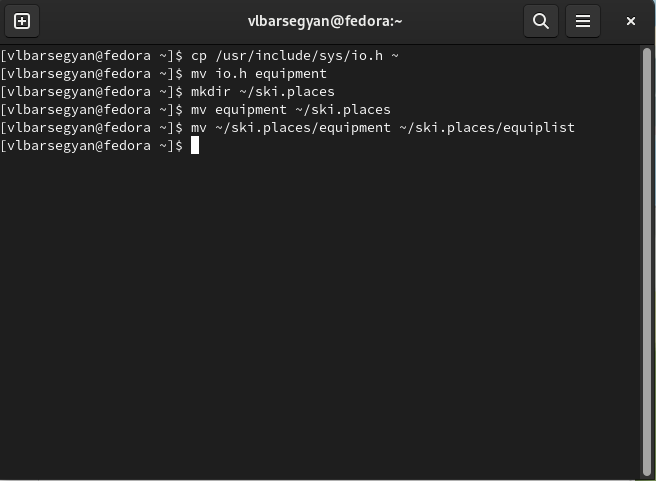{#fig:022 width=70%}

3. Создаю файл abc1, копирую его в каталог ~/ski.plases, называю equiplist2 (рис. @fig:023).

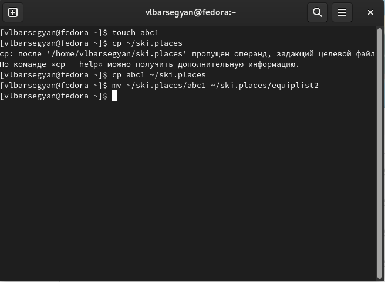{#fig:023 width=70%}

4. Создаю каталог с именем equipment в каталоге ~/ski.plases, перемещаю файлы ~/ski.plases/equiplist и equiplist2 в каталог ~/ski.plases/equipment (рис. @fig:024).

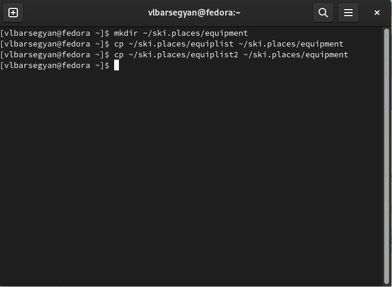{#fig:024 width=70%}

5. Создаю и перемещаю каталог ~/newdir в каталог ~/ski.plases и называю его plans (рис. @fig:025).

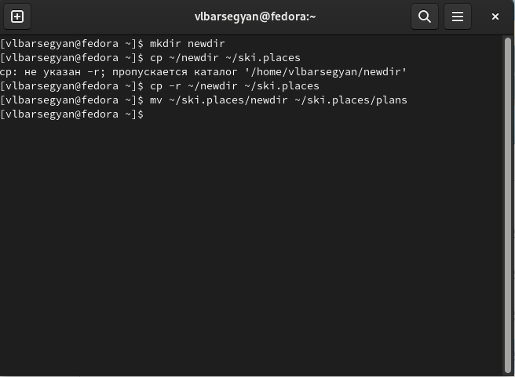{#fig:025 width=70%} 

6. Создаю каталоги australia, play и файлы my_os, feathers. Проверяю их права доступа до изменений (рис. @fig:026).

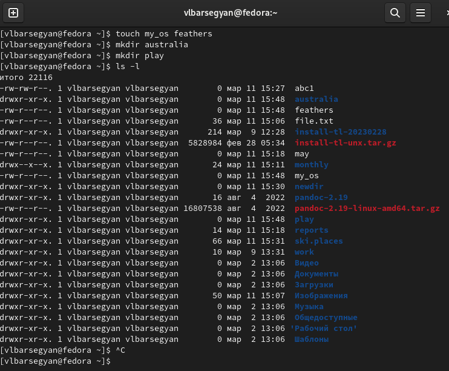{#fig:026 width=70%} 

7. С помощью команды chmod изменяю права доступа этим файлам и каталогам следующим образом (рис. @fig:027).

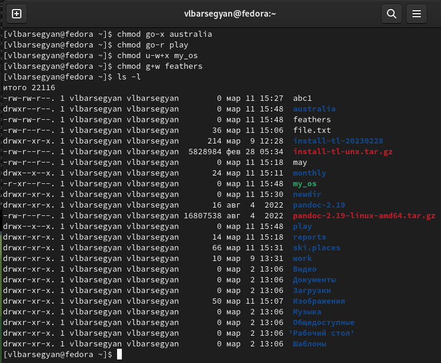{#fig:027 width=70%} 

8. Просматриваю содержимое файла /etc/passwd с помощью команды cat (рис. @fig:028).

{#fig:028 width=70%} 

9. Копирую файл ~/feathers в файл ~/file.old (команда cp), перемещаю файл ~/file.old в каталог ~/play (команда mv), копирую каталог ~/play в каталог ~/fun (команда cp) (рис. @fig:029).

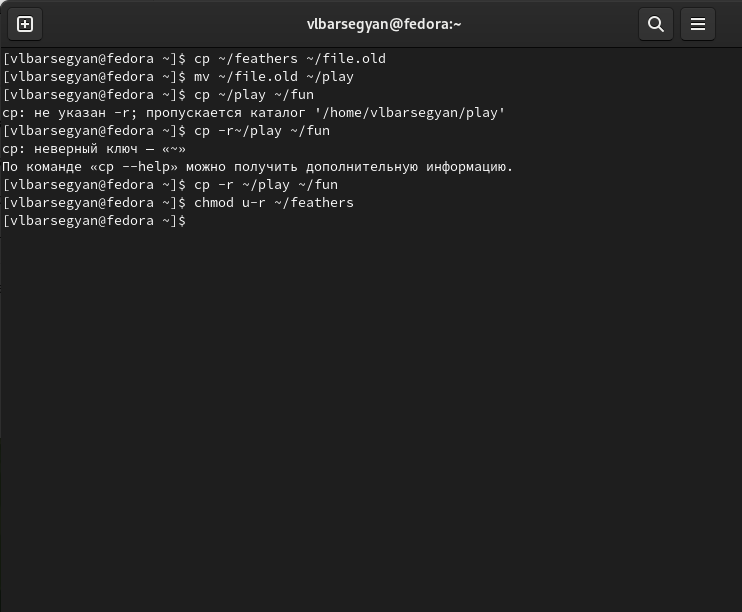{#fig:029 width=70%} 

10. Перемещаю каталог ~/fun в каталог ~/play (команда mv) и называю его games (команда mv) (рис. @fig:036).

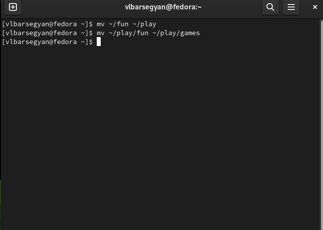{#fig:036 width=70%} 

11. Лишаю владельца файла ~/feathers права на чтение командой сhmod u-r ~/feathers (рис. @fig:029).

{#fig:029 width=70%} 

12. Пытаюсь просмотреть файл командой cat и получаю сообщение "отказано в доступе", т.к. были убраны права на чтение. Аналогично при попытке копирования файла командой ср отказано в доступе. Даю владельцу файла ~/feathers право на чтение командой chmod u+r ~/feathers, проверяю и теперь можно открывать и копировать эьтот файл. (рис. @fig:030).

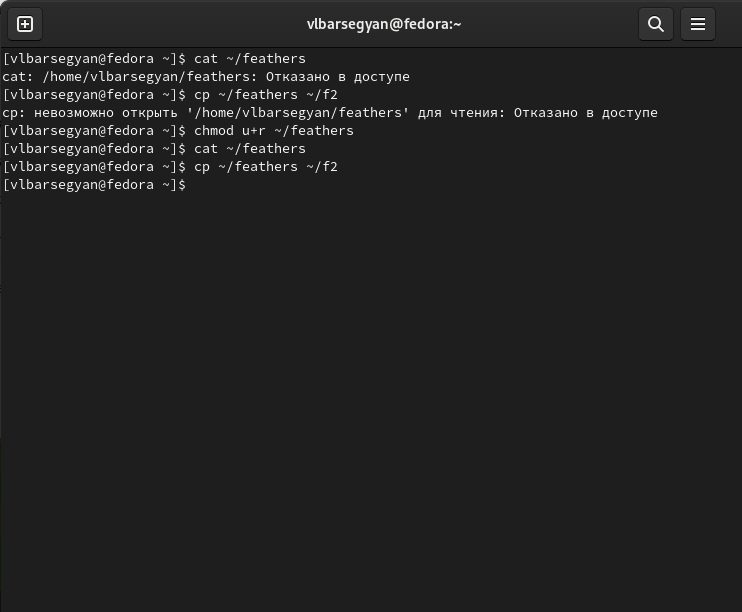{#fig:030 width=70%} 

13. Лишаю владельца каталога ~/play права на выполнение командой chmod u-x. При попытке перейти в каталог возникает исключение "отказано в доступе". Возвращаю владельцу права на выполнение командой chmod u+x и после этого в каталог можно перейти. (рис. @fig:031).

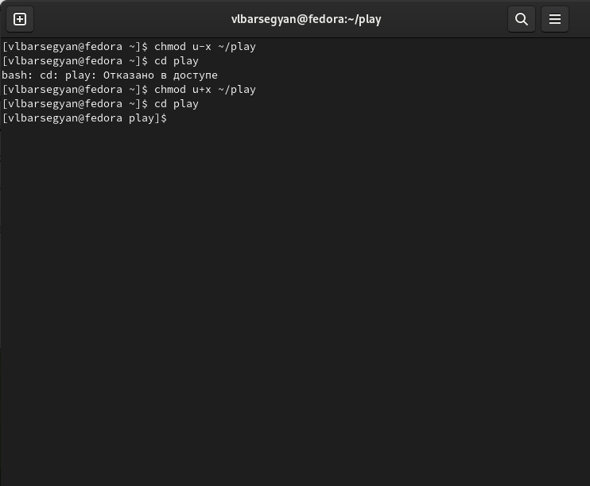{#fig:031 width=70%} 

14. Читаю man по команде mount. Команда mount используется для просмотра используемых в ОС файловых систем (рис. @fig:032)

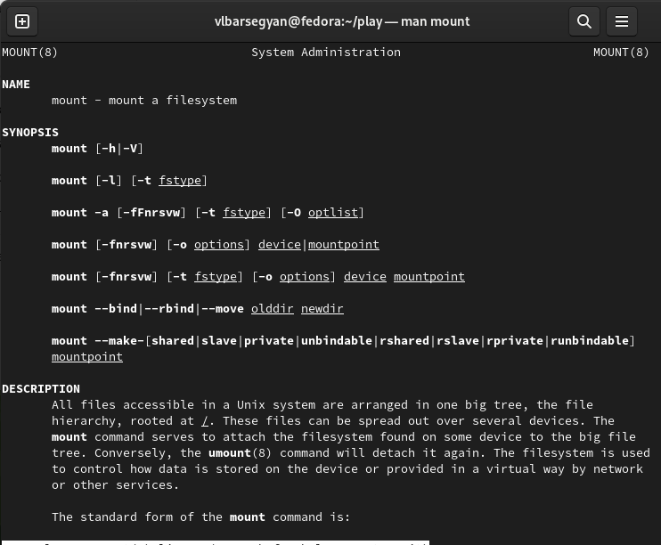{#fig:032 width=70%} 

15. Читаю man по команде fsck. Команда fsck используется для проверки (а иногда восстановления) целостности файловой системы (рис. @fig:033)

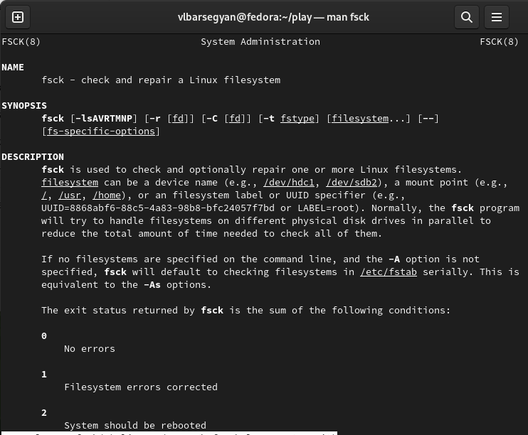{#fig:033 width=70%} 

16. Читаю man по команде mkfs. Команда mkfs используется для создания файловой системы Линукс на устройстве, обычно в разделе жесткого диска. В качестве аргумента может выступать название устройства или точка монтирования (рис. @fig:034)

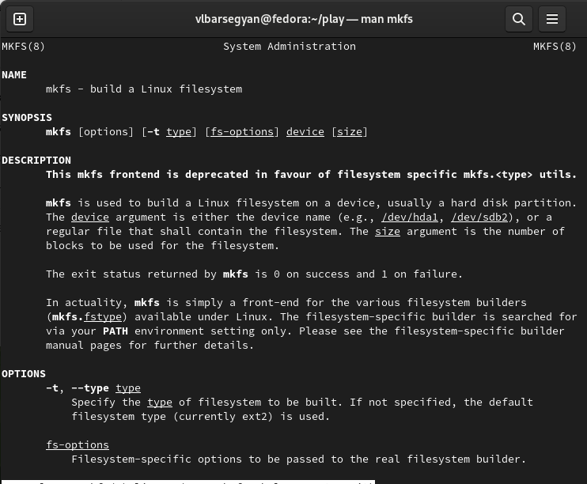{#fig:034 width=70%} 

17. Читаю man по команде kill. Команда kill используется для отправки сигнала процессу, указанного с помощью каждого из операндов (рис. @fig:035)

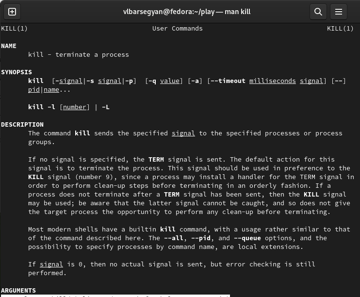{#fig:035 width=70%} 

# Выводы

В ходе выполнения лабораторной работы я освоил команды для работы с файлами и каталогами, научился копировать файлы и каталоги в системе Linux, также я научился перемещать и переименовывать файлы, узнал про права доступа и их изменение для разных категорий, также я узнал про анализ файловой системы и команды для этого.

