---
## Front matter
lang: ru-RU
title: Поиск файлов. Перенаправление ввода-вывода. Просмотр запущенных процессов
subtitle: Операционные Системы
author:
  - Барсегян В.Л.
institute:
  - Российский университет дружбы народов, Москва, Россия
date: 14.03.2023г.

## i18n babel
babel-lang: russian
babel-otherlangs: english

## Formatting pdf
toc: false
toc-title: Содержание
slide_level: 2
aspectratio: 169
section-titles: true
theme: metropolis
header-includes:
 - \metroset{progressbar=frametitle,sectionpage=progressbar,numbering=fraction}
 - '\makeatletter'
 - '\beamer@ignorenonframefalse'
 - '\makeatother'
---

## Докладчик

  * Барсегян Вардан Левонович
  * НПИбд-01-22
  * Российский университет дружбы народов
  * [1132222005@pfur.ru]
  * <https://github.com/VARdamn/study_2022-2023_os-intro>

# Вводная часть

## Цели и задачи

Ознакомление с инструментами поиска файлов и фильтрации текстовых данных.
Приобретение практических навыков: по управлению процессами (и заданиями), по
проверке использования диска и обслуживанию файловых систем.

## Задание

1. Осуществите вход в систему, используя соответствующее имя пользователя.
2. Запишите в файл file.txt названия файлов, содержащихся в каталоге /etc. Допишите в этот же файл названия файлов, содержащихся в вашем домашнем каталоге.
3. Выведите имена всех файлов из file.txt, имеющих расширение .conf, после чего запишите их в новый текстовой файл conf.txt.
4. Определите, какие файлы в вашем домашнем каталоге имеют имена, начинавшиеся с символа c? Предложите несколько вариантов, как это сделать.
5. Выведите на экран (по странично) имена файлов из каталога /etc, начинающиеся с символа h.

## Задание

6. Запустите в фоновом режиме процесс, который будет записывать в файл ~/logfile файлы, имена которых начинаются с log.
7. Удалите файл ~/logfile.
8. Запустите из консоли в фоновом режиме редактор gedit.
9. Определите идентификатор процесса gedit, используя команду ps, конвейер и фильтр grep. Как ещё можно определить идентификатор процесса?
10. Прочтите справку (man) команды kill, после чего используйте её для завершения процесса gedit.
11. Выполните команды df и du, предварительно получив более подробную информацию об этих командах, с помощью команды man.
12. Воспользовавшись справкой команды find, выведите имена всех директорий, имеющихся в вашем домашнем каталоге.

# Выполнение лабораторной работы

## Выполнение п. 2

С помощью команды *find* записываю в файл *file.txt* названия файлов, содержащихся в каталоге /etc. Далее в этот же файл дописываю названия файлов, содержащихся в домашнем каталоге

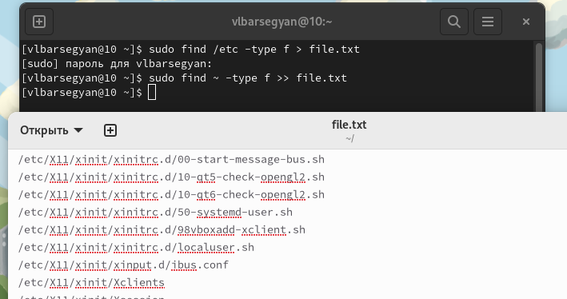{#fig:001 width=60%}

## Выполнение п. 3

Вывожу в консоль имена всех файлов, имеющих расширение *.conf*

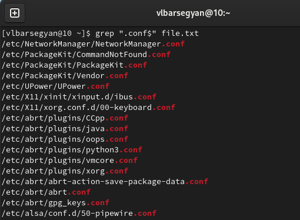{#fig:002 width=55%}

## Выполнение п. 3

После этого записываю их в новый текстовой файл conf.txt

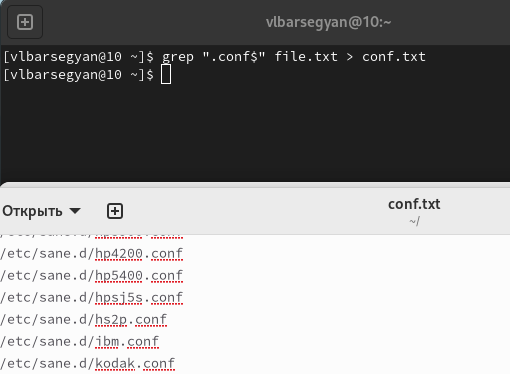{#fig:003 width=55%}

## Выполнение п. 4

Определяю, какие файлы в вашем домашнем каталоге имеют имена, начинающиеся с символа *c*. Делаю это с помощью команд *find* и *ls | grep* 

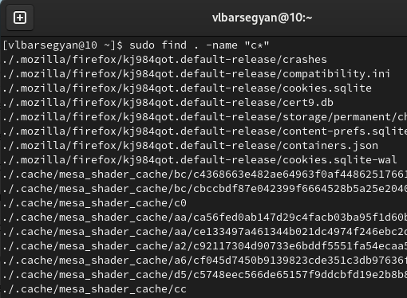{#fig:004 width=48%}

## Выполнение п. 4

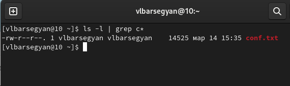{#fig:005 width=70%}

## Выполнение п. 5

С помощью команды *sudo find /etc -name h* | less* вывожу на экран постранично имена файлов из каталога /etc, начинающиеся
с символа h

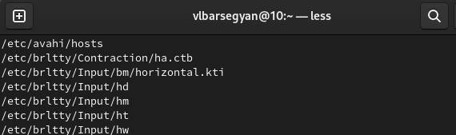{#fig:006 width=65%}

## Выполнение пп. 6, 7

Запускаю с помощью амперсанда в фоновом режиме процесс, который будет записывать в файл ~/logfile файлы, имена которых начинаются с log. Далее, удаляю полученный файл с помощью команды *rm* 

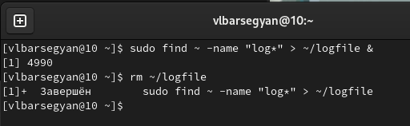{#fig:007 width=60%}

## Выполнение п. 8

Запускаю из консоли в фоновом режиме редактор gedit

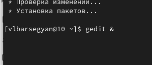{#fig:008 width=60%}

## Выполнение п. 9

Определяю идентификатор процесса gedit с помощью команды *ps aux | grep gedit*, получаю идентификатор 3672. Также идентификатор выводится в консоль при запуске в фоновом режиме, и с помощью команды *pidof*

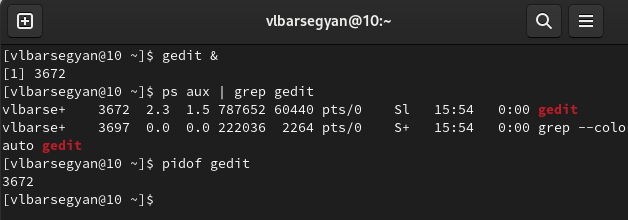{#fig:009 width=60%}

## Выполнение п. 10

Завершаю процесс gedit с помощью команды *kill <идентификатор_процесса>*

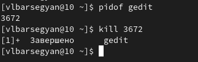{#fig:011 width=60%}

## Выполнение п. 11

Выполняю команду *df* 

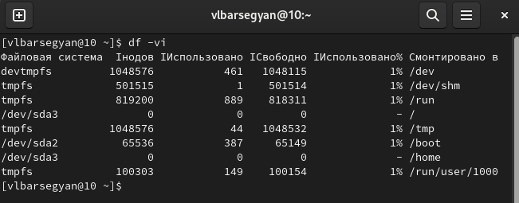{#fig:014 width=60%}

## Выполнение п. 11

Выполняю команду *du*

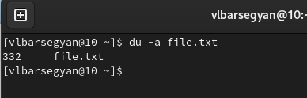{#fig:015 width=60%}

## Выполнение п. 12

Вывожу имена всех директорий, имеющихся в домашнем каталоге, используя опцию -type d

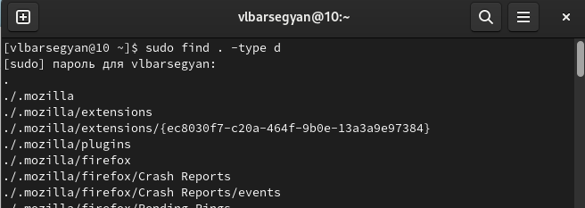{#fig:017 width=60%}

## Вывод

Я познакомился с инструментами для поиска файлов и фильтрации текстовых данных. Научился управлять процессами в Linux, проверять использование диска, обслуживать файловые системы. Использовал команды find, grep, ps, df, du, kill, также использовал конвейер и перенаправление ввода-вывода.
