---
## Front matter
title: "Лабораторная Работа №6"
subtitle: "Поиск файлов. Перенаправление
ввода-вывода. Просмотр запущенных процессов"
author: "Барсегян Вардан Левонович"

## Generic otions
lang: ru-RU
toc-title: "Содержание"

## Bibliography
bibliography: bib/cite.bib
csl: pandoc/csl/gost-r-7-0-5-2008-numeric.csl

## Pdf output format
toc: true # Table of contents
toc-depth: 2
lof: true # List of figures
lot: true # List of tables
fontsize: 12pt
linestretch: 1.5
papersize: a4
documentclass: scrreprt
## I18n polyglossia
polyglossia-lang:
  name: russian
  options:
	- spelling=modern
	- babelshorthands=true
polyglossia-otherlangs:
  name: english
## I18n babel
babel-lang: russian
babel-otherlangs: english
## Fonts
mainfont: PT Serif
romanfont: PT Serif
sansfont: PT Sans
monofont: PT Mono
mainfontoptions: Ligatures=TeX
romanfontoptions: Ligatures=TeX
sansfontoptions: Ligatures=TeX,Scale=MatchLowercase
monofontoptions: Scale=MatchLowercase,Scale=0.9
## Biblatex
biblatex: true
biblio-style: "gost-numeric"
biblatexoptions:
  - parentracker=true
  - backend=biber
  - hyperref=auto
  - language=auto
  - autolang=other*
  - citestyle=gost-numeric
## Pandoc-crossref LaTeX customization
figureTitle: "Рис."
tableTitle: "Таблица"
listingTitle: "Листинг"
lofTitle: "Список иллюстраций"
lotTitle: "Список таблиц"
lolTitle: "Листинги"
## Misc options
indent: true
header-includes:
  - \usepackage{indentfirst}
  - \usepackage{float} # keep figures where there are in the text
  - \floatplacement{figure}{H} # keep figures where there are in the text
---

# Цель работы

Ознакомление с инструментами поиска файлов и фильтрации текстовых данных.
Приобретение практических навыков: по управлению процессами (и заданиями), по
проверке использования диска и обслуживанию файловых систем.

# Задание

1. Осуществите вход в систему, используя соответствующее имя пользователя.
2. Запишите в файл file.txt названия файлов, содержащихся в каталоге /etc. Допишите в этот же файл названия файлов, содержащихся в вашем домашнем каталоге.
3. Выведите имена всех файлов из file.txt, имеющих расширение .conf, после чего запишите их в новый текстовой файл conf.txt.
4. Определите, какие файлы в вашем домашнем каталоге имеют имена, начинавшиеся с символа c? Предложите несколько вариантов, как это сделать.
5. Выведите на экран (по странично) имена файлов из каталога /etc, начинающиеся с символа h.
6. Запустите в фоновом режиме процесс, который будет записывать в файл ~/logfile файлы, имена которых начинаются с log.

# Задание

7. Удалите файл ~/logfile.
8. Запустите из консоли в фоновом режиме редактор gedit.
9. Определите идентификатор процесса gedit, используя команду ps, конвейер и фильтр grep. Как ещё можно определить идентификатор процесса?
10. Прочтите справку (man) команды kill, после чего используйте её для завершения процесса gedit.
11. Выполните команды df и du, предварительно получив более подробную информацию об этих командах, с помощью команды man.
12. Воспользовавшись справкой команды find, выведите имена всех директорий, имеющихся в вашем домашнем каталоге.

# Выполнение лабораторной работы

1. С помощью команды *find* записываю в файл *file.txt* названия файлов, содержащихся в каталоге /etc. Далее в этот же файл дописываю названия файлов, содержащихся в домашнем каталоге (рис. @fig:001).

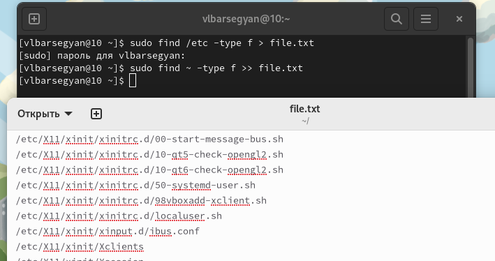{#fig:001 width=70%}

2. Вывожу в консоль имена всех файлов, имеющих расширение *.conf* (рис. @fig:002)

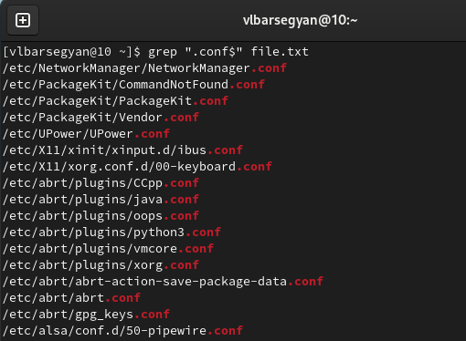{#fig:002 width=70%}

После этого записываю их в новый текстовой файл conf.txt (рис. @fig:003).

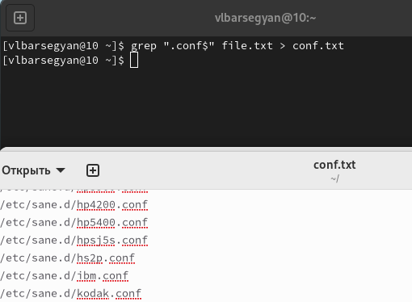{#fig:003 width=70%}
 
3. Определяю, какие файлы в вашем домашнем каталоге имеют имена, начинающиеся с символа *c*. Делаю это с помощью команд *find* (рис. @fig:004) и *ls | grep* (рис. @fig:005)

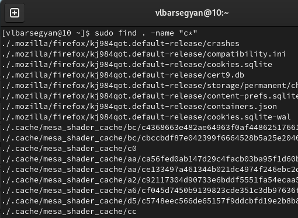{#fig:004 width=70%}

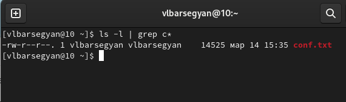{#fig:005 width=70%}

4. С помощью команды *sudo find /etc -name h* | less* вывожу на экран постранично имена файлов из каталога /etc, начинающиеся
с символа h (рис. @fig:006)

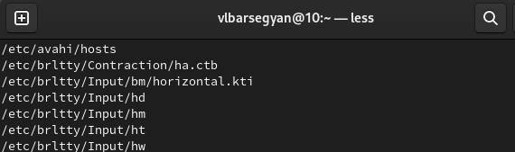{#fig:006 width=70%}

5. Запускаю с помощью амперсанда в фоновом режиме процесс, который будет записывать в файл ~/logfile файлы, имена которых начинаются с log. Далее, удаляю полученный файл с помощью команды *rm* (рис. @fig:007)

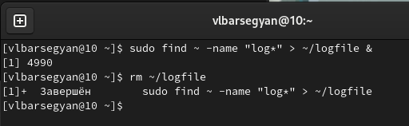{#fig:007 width=70%}

6. Запускаю из консоли в фоновом режиме редактор gedit (рис. @fig:008)

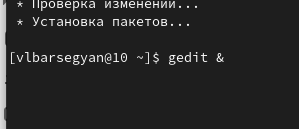{#fig:008 width=70%}

7. Определяю идентификатор процесса gedit с помощью команды *ps aux | grep gedit*, получаю идентификатор 3672. Также идентификатор выводится в консоль при запуске в фоновом режиме, и с помощью команды *pidof* (рис. @fig:009)

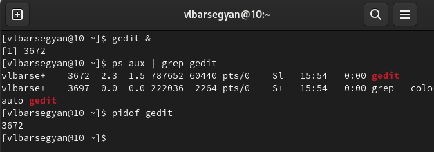{#fig:009 width=70%}

8. Читаю man команды kill (рис. @fig:010)

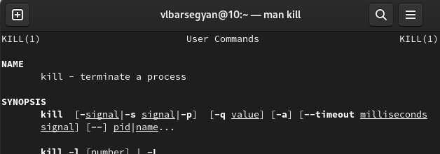{#fig:010 width=70%}

9. Завершаю процесс gedit с помощью команды *kill <идентификатор_процесса>* (рис. @fig:011)

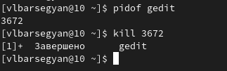{#fig:011 width=70%}

10. Смотрю справки по командам df, du (man df, man du) (рис. @fig:012, рис. @fig:013)

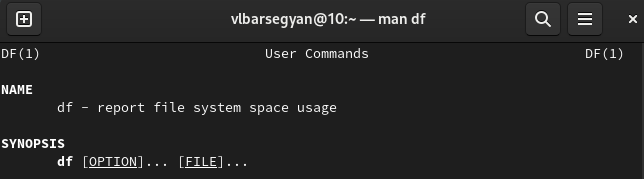{#fig:012 width=70%}

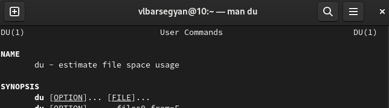{#fig:013 width=70%}

11. Выполняю команду *df* (рис. @fig:014)

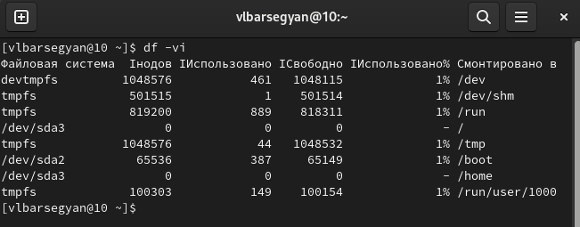{#fig:014 width=70%}

12. Выполняю команду *du* (рис. @fig:015)

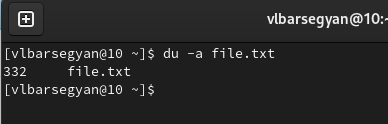{#fig:015 width=70%}

13. Смотрю справку о команде find (рис. @fig:016)

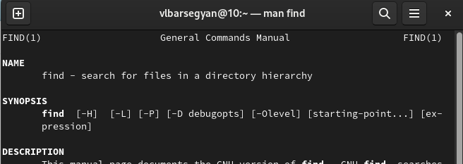{#fig:016 width=70%}

14. Вывожу имена всех директорий, имеющихся в домашнем каталоге, используя опцию -type d (рис. @fig:017)

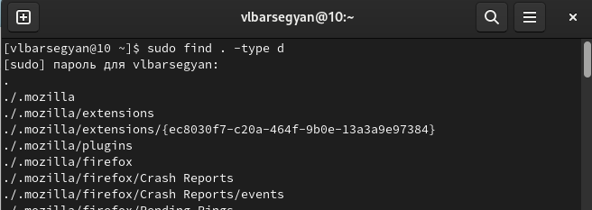{#fig:017 width=70%}

# Выводы

Я познакомился с инструментами для поиска файлов и фильтрации текстовых данных. Научился управлять процессами в Linux, проверять использование диска, обслуживать файловые системы. Использовал команды find, grep, ps, df, du, kill, также использовал конвейер и перенаправление ввода-вывода.

