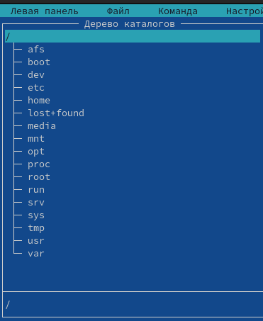
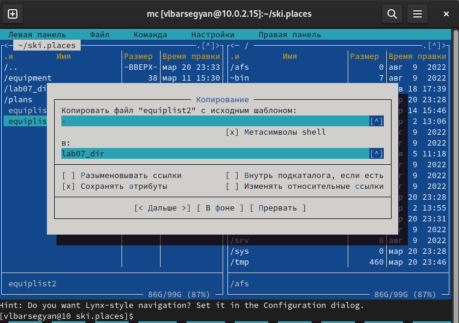

---
## Front matter
lang: ru-RU
title: Командная оболочка Midnight Commander
subtitle: Операционные Системы
author:
  - Барсегян В.Л.
institute:
  - Российский университет дружбы народов, Москва, Россия
date: 21.03.2023г.

## i18n babel
babel-lang: russian
babel-otherlangs: english

## Formatting pdf
toc: false
toc-title: Содержание
slide_level: 2
aspectratio: 169
section-titles: true
theme: metropolis
header-includes:
 - \metroset{progressbar=frametitle,sectionpage=progressbar,numbering=fraction}
 - '\makeatletter'
 - '\beamer@ignorenonframefalse'
 - '\makeatother'
---

# Информация

## Докладчик

  * Барсегян Вардан Левонович
  * НПИбд-01-22
  * Российский университет дружбы народов
  * [1132222005@pfur.ru]
  * <https://github.com/VARdamn/study_2022-2023_os-intro>

# Вводная часть

## Цели и задачи

Освоение основных возможностей командной оболочки Midnight Commander. Приобретение навыков практической работы по просмотру каталогов и файлов; манипуляций
с ними.

# Выполнение лабораторной работы

## Читаю справку по команде mc 

{#fig:001 width=60%}

## Запускаю оболочку mc, изучаю его структуру и меню 

{#fig:002 width=60%}

## Выполняю несколько операций в mc: выделение и отмена выделения файла, копирование файла, перемещение файла, информация, информация о правах доступа файла, его владельце

{#fig:003 width=60%}

## Копирование файла

{#fig:004 width=60%}

## Перемещение файла

{#fig:005 width=60%}

## Информация

{#fig:006 width=60%}

## Информация о правах доступа файла

{#fig:007 width=60%}

## Открываю меню левой панели 

{#fig:008 width=30%}

## Просматриваю в данном меню дерево каталогов, информацию о каталоге

{#fig:009 width=35%}

## Информация о каталоге

{#fig:010 width=50%}

## Просматриваю содержимое текстового файла, используя клавишу F3

{#fig:011 width=60%}

## Открываю файл для редактирования, используя клавишу F4

{#fig:012 width=60%}

## Создаю новый каталог, используя клавишу F7

{#fig:013 width=60%}

## Копирую файл в данный каталог, используя клавишу F5

{#fig:014 width=60%}

## В подменю Команда произвожу поиск файла с заданными условиями 

{#fig:015 width=60%}

## История предыдущей команды

{#fig:016 width=60%}

## С помощью дерева каталогов перехожу в домашнюю папку

{#fig:017 width=60%}

## Открываю анализ файла меню

{#fig:018 width=60%}

## Открываю анализ файла расширений 

{#fig:019 width=60%}

## В подменю настройки открываю изменение внешнего вида редактора

{#fig:020 width=60%}

## Создаю файл text.txt

{#fig:021 width=60%}

## Открываю этот файл с помощью встроенного в mc редактора

{#fig:022 width=60%}

## Вставляю в этот файл текст

{#fig:023 width=60%}

## Удаляю строку текста, используя Сtrl+y

{#fig:024 width=60%}

## Выделяю фрагмент текста и копирую его, используя F3, F5

{#fig:025 width=60%}

## Выделяю фрагмент текста и пермещаю его, используя F3, F6

{#fig:026 width=60%}

## Сохраняю файл, используя F2

{#fig:027 width=60%}

## Отменяю последнее действие, используя Ctrl+U 

{#fig:028 width=60%}

## Перехожу сначала в конец файла (сочетание Ctrl+End), пишу текст, далее перехожу в начало файла (сочетание Ctrl+Home), пишу текст 

{#fig:029 width=60%} 

## В файле с настройкой подсветки синтаксиса редактора mc нахожу include unknown.syntax, меняю на unclude sh.syntax

{#fig:030 width=50%}

## Открываю С файл в mc, теперь подсветка синтаксиса работает

{#fig:031 width=60%}

## Вывод

Я научился углубленно работать с мс, освоил множество горячих клавиш данного редактора, изучил меню различных настроек и конфигураций, приобрел практические навыки по работе, просмотру, редактированию файлов и каталогов через midnight commander, включил подсветку синтаксиса.

