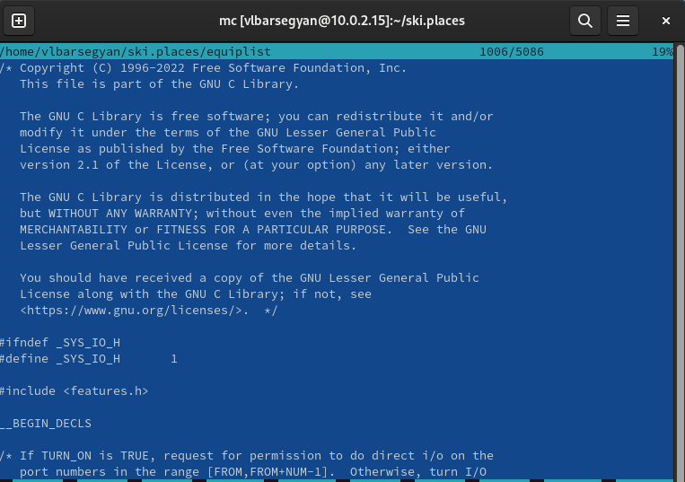

---
## Front matter
title: "Лабораторная Работа №7"
subtitle: "Командная оболочка Midnight Commander"
author: "Барсегян Вардан Левонович"

## Generic otions
lang: ru-RU
toc-title: "Содержание"

## Bibliography
bibliography: bib/cite.bib
csl: pandoc/csl/gost-r-7-0-5-2008-numeric.csl

## Pdf output format
toc: true # Table of contents
toc-depth: 2
lof: true # List of figures
lot: true # List of tables
fontsize: 12pt
linestretch: 1.5
papersize: a4
documentclass: scrreprt
## I18n polyglossia
polyglossia-lang:
  name: russian
  options:
	- spelling=modern
	- babelshorthands=true
polyglossia-otherlangs:
  name: english
## I18n babel
babel-lang: russian
babel-otherlangs: english
## Fonts
mainfont: PT Serif
romanfont: PT Serif
sansfont: PT Sans
monofont: PT Mono
mainfontoptions: Ligatures=TeX
romanfontoptions: Ligatures=TeX
sansfontoptions: Ligatures=TeX,Scale=MatchLowercase
monofontoptions: Scale=MatchLowercase,Scale=0.9
## Biblatex
biblatex: true
biblio-style: "gost-numeric"
biblatexoptions:
  - parentracker=true
  - backend=biber
  - hyperref=auto
  - language=auto
  - autolang=other*
  - citestyle=gost-numeric
## Pandoc-crossref LaTeX customization
figureTitle: "Рис."
tableTitle: "Таблица"
listingTitle: "Листинг"
lofTitle: "Список иллюстраций"
lotTitle: "Список таблиц"
lolTitle: "Листинги"
## Misc options
indent: true
header-includes:
  - \usepackage{indentfirst}
  - \usepackage{float} # keep figures where there are in the text
  - \floatplacement{figure}{H} # keep figures where there are in the text
---

# Цель работы

Освоение основных возможностей командной оболочки Midnight Commander. Приобретение навыков практической работы по просмотру каталогов и файлов; манипуляций
с ними.

# Выполнение лабораторной работы

## Задание по mc

1. Читаю справку по команде mc (рис. @fig:001).

{#fig:001 width=70%}

2. Запускаю оболочку mc, изучаю его структуру и меню (рис. @fig:002).

{#fig:002 width=70%}

3. Выполняю несколько операций в mc: выделение и отмена выделения файла (рис. @fig:003), копирование файла (рис. @fig:004), перемещение файла (рис. @fig:005), информация (рис. @fig:006), информация о правах доступа файла, его владельце (рис. @fig:007)

{#fig:003 width=70%}

{#fig:004 width=70%}

{#fig:005 width=70%}

{#fig:006 width=70%}

{#fig:007 width=70%}

4. Открываю меню левой панели (рис. @fig:008)

{#fig:008 width=70%}

5. Просматриваю в данном меню дерево каталогов (рис. @fig:009), информацию о каталоге (рис. @fig:010)

{#fig:009 width=70%}

{#fig:010 width=70%}

6. Просматриваю содержимое текстового файла, используя клавишу F3 (рис. @fig:011)

{#fig:011 width=70%}

7. Открываю файл для редактирования, используя клавишу F4 (рис. @fig:012)

{#fig:012 width=70%}

8. Создаю новый каталог, используя клавишу F7 (рис. @fig:013)

{#fig:013 width=70%}

9. Копирую файл в данный каталог, используя клавишу F5 (рис. @fig:014)

{#fig:014 width=70%}

10. В подменю Команда произвожу поиск файла с заданными условиями (рис. @fig:015)

{#fig:015 width=70%}

11. История предыдущей команды (рис. @fig:016)

{#fig:016 width=70%}

12. С помощью дерева каталогов перехожу в домашнюю папку (рис. @fig:017)

{#fig:017 width=70%}

13. Открываю анализ файла меню (рис. @fig:018)

{#fig:018 width=70%}

14. Открываю анализ файла расширений (рис. @fig:019)

{#fig:019 width=70%}

15. В подменю настройки открываю изменение внешнего вида редактора (рис. @fig:020)

{#fig:020 width=70%}

## Задание по встроенному редактору mc

1. Создаю файл text.txt (рис. @fig:021)

{#fig:021 width=70%}

2. Открываю этот файл с помощью встроенного в mc редактора (рис. @fig:022)

{#fig:022 width=70%}

3. Вставляю в этот файл текст (рис. @fig:023)

{#fig:023 width=70%}

4. Удаляю строку текста, используя Сtrl+y (рис. @fig:024)

{#fig:024 width=70%}

5. Выделяю фрагмент текста и копирую его, используя F3, F5 (рис. @fig:025)

{#fig:025 width=70%}

6. Выделяю фрагмент текста и пермещаю его, используя F3, F6 (рис. @fig:026)

{#fig:026 width=70%}

7. Сохраняю файл, используя F2 (рис. @fig:027)

{#fig:027 width=70%}

8. Отменяю последнее действие, используя Ctrl+U (рис. @fig:028)

{#fig:028 width=70%}

9. Перехожу сначала в конец файла (сочетание Ctrl+End), пишу текст, далее перехожу в начало файла (сочетание Ctrl+Home), пишу текст (рис. @fig:029)

{#fig:029 width=70%} 

10. В файле с настройкой подсветки синтаксиса редактора mc нахожу include unknown.syntax, меняю на unclude sh.syntax (рис. @fig:030)

{#fig:030 width=70%}

11. Открываю С файл в mc, теперь подсветка синтаксиса работает (рис. @fig:031)

{#fig:031 width=70%}

# Выводы

Я научился углубленно работать с мс, освоил множество горячих клавиш данного редактора, изучил меню различных настроек и конфигураций, приобрел практические навыки по работе, просмотру, редактированию файлов и каталогов через midnight commander, включил подсветку синтаксиса.

