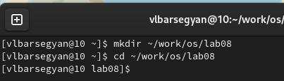
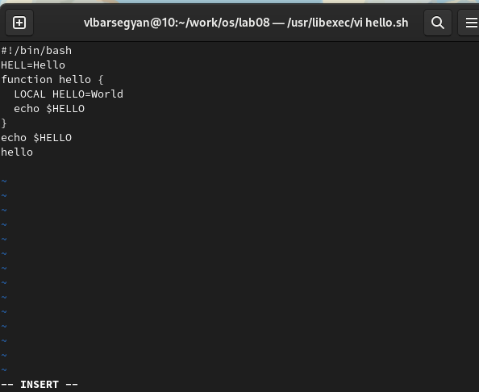
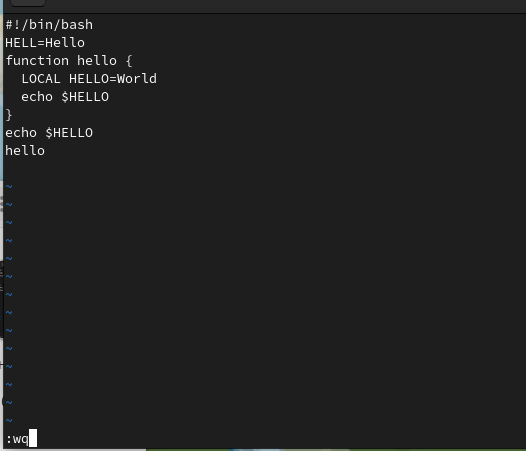
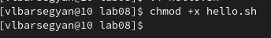
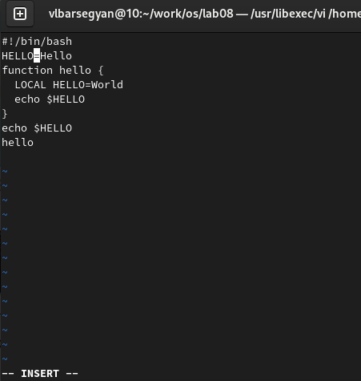
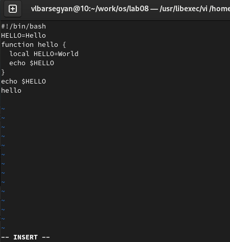
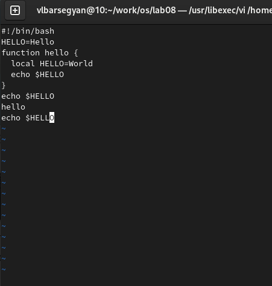
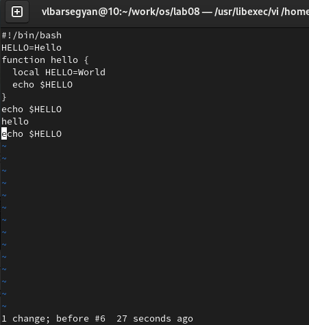
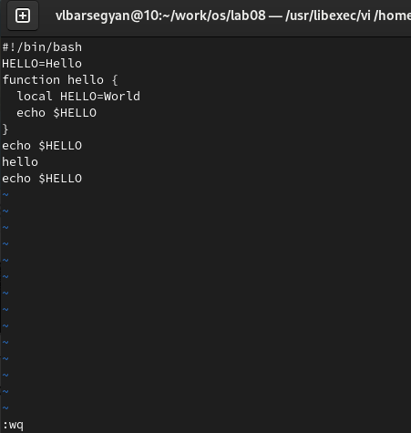

---
## Front matter
lang: ru-RU
title: Текстовой редактор vi
subtitle: Операционные Системы
author:
  - Барсегян В.Л.
institute:
  - Российский университет дружбы народов, Москва, Россия
date: 23.03.2023г.

## i18n babel
babel-lang: russian
babel-otherlangs: english

## Formatting pdf
toc: false
toc-title: Содержание
slide_level: 2
aspectratio: 169
section-titles: true
theme: metropolis
header-includes:
 - \metroset{progressbar=frametitle,sectionpage=progressbar,numbering=fraction}
 - '\makeatletter'
 - '\beamer@ignorenonframefalse'
 - '\makeatother'
---

## Докладчик

  * Барсегян Вардан Левонович
  * НПИбд-01-22
  * Российский университет дружбы народов
  * [1132222005@pfur.ru]
  * <https://github.com/VARdamn/study_2022-2023_os-intro>

# Вводная часть

## Цели и задачи

Познакомиться с операционной системой Linux. Получить практические навыки работы с редактором vi, установленным по умолчанию практически во всех дистрибутивах.

## Задание

1. Создайте каталог с именем ~/work/os/lab06.
2. Перейдите во вновь созданный каталог.
3. Вызовите vi и создайте файл hello.sh
4. Нажмите клавишу i и вводите следующий текст
5. Нажмите клавишу Esc для перехода в командный режим после завершения ввода текста.
6. Нажмите : для перехода в режим последней строки и внизу вашего экрана появится приглашение в виде двоеточия.
7. Нажмите w (записать) и q (выйти), а затем нажмите клавишу Enter для сохранения вашего текста и завершения работы.
8. Сделайте файл исполняемым

## Задание 2

1. Вызовите vi на редактирование файла
2. Установите курсор в конец слова HELL второй строки.
3. Перейдите в режим вставки и замените на HELLO. Нажмите Esc для возврата в командный режим.
4. Установите курсор на четвертую строку и сотрите слово LOCAL.
5. Перейдите в режим вставки и наберите следующий текст: local, нажмите Esc для
возврата в командный режим.
6. Установите курсор на последней строке файла. Вставьте после неё строку, содержащую следующий текст: echo $HELLO.
7. Нажмите Esc для перехода в командный режим.
8. Удалите последнюю строку.
9. Введите команду отмены изменений u для отмены последней команды.
10. Введите символ : для перехода в режим последней строки. Запишите произведённые
изменения и выйдите из vi.

# Выполнение лабораторной работы

## Создаю папку с помощью команды mkdir, перехожу в нее

{#fig:001 width=70%}

## Создаю файл hello.sh и открываю его в vi с помощью команды vi hello.sh 

{#fig:002 width=50%}

## С помощью клавиши i перехожу в режим вставки, записываю код в файл. Нажимаю на :, в нижней строке пишу wq для сохранения записанного и выхода из файла

{#fig:003 width=50%}

## Делаю файл исполняемым с помощью команды chmod +x hello.sh 

{#fig:004 width=70%}

## Вызываю vi на редактирование файла с помощью команды vi ~/work/os/lab06/hello.sh 

{#fig:005 width=70%}

## Устанавливаю курсор в конец слова HELL второй строки, перехожу в режим вставки (клавиша i), меняю HELL на HELLO

{#fig:006 width=40%}

## Устанавливаю курсор на четвертую строку и стираю слово LOCAL, перехожу в режим вставки и пишу local 

{#fig:007 width=40%}

## Устанавливаю курсор на последней строке файла, вставляю в конец файла текст echo $HELLO. Перехожу в командный режим с помощью клавиши Esc

{#fig:008 width=40%}

## С помощью сочетания :d удаляю последнюю строку файла 

{#fig:009 width=40%}

## С помощью команды u отменяю последнее действие, в файл возвращается последняя строка, которая была удалена 

{#fig:010 width=40%}

## Ввожу символ ":", перехожу в режим последней строки. Пишу wq для сохранения изменений в файле и выхода из него

{#fig:011 width=40%}

## Вывод

Я ознакомился с принципом работы редактора vi, его основными командами и горячими клавишами, создал файл и открыл его в vi, а также редактировал его в этом редакторе.
