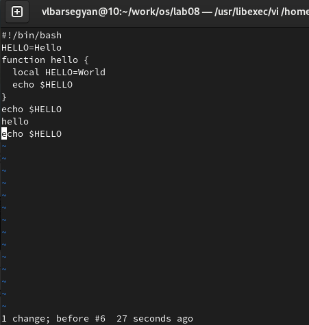

---
## Front matter
title: "Лабораторная работа №8"
subtitle: "Текстовой редактор vi"
author: "Барсегян Вардан Левонович"

## Generic otions
lang: ru-RU
toc-title: "Содержание"

## Bibliography
bibliography: bib/cite.bib
csl: pandoc/csl/gost-r-7-0-5-2008-numeric.csl

## Pdf output format
toc: true # Table of contents
toc-depth: 2
lof: true # List of figures
lot: true # List of tables
fontsize: 12pt
linestretch: 1.5
papersize: a4
documentclass: scrreprt
## I18n polyglossia
polyglossia-lang:
  name: russian
  options:
	- spelling=modern
	- babelshorthands=true
polyglossia-otherlangs:
  name: english
## I18n babel
babel-lang: russian
babel-otherlangs: english
## Fonts
mainfont: PT Serif
romanfont: PT Serif
sansfont: PT Sans
monofont: PT Mono
mainfontoptions: Ligatures=TeX
romanfontoptions: Ligatures=TeX
sansfontoptions: Ligatures=TeX,Scale=MatchLowercase
monofontoptions: Scale=MatchLowercase,Scale=0.9
## Biblatex
biblatex: true
biblio-style: "gost-numeric"
biblatexoptions:
  - parentracker=true
  - backend=biber
  - hyperref=auto
  - language=auto
  - autolang=other*
  - citestyle=gost-numeric
## Pandoc-crossref LaTeX customization
figureTitle: "Рис."
tableTitle: "Таблица"
listingTitle: "Листинг"
lofTitle: "Список иллюстраций"
lotTitle: "Список таблиц"
lolTitle: "Листинги"
## Misc options
indent: true
header-includes:
  - \usepackage{indentfirst}
  - \usepackage{float} # keep figures where there are in the text
  - \floatplacement{figure}{H} # keep figures where there are in the text
---

# Цель работы

Познакомиться с операционной системой Linux. Получить практические навыки работы с редактором vi, установленным по умолчанию практически во всех дистрибутивах.

# Задание

1. Создайте каталог с именем ~/work/os/lab06.
2. Перейдите во вновь созданный каталог.
3. Вызовите vi и создайте файл hello.sh
4. Нажмите клавишу i и вводите следующий текст
5. Нажмите клавишу Esc для перехода в командный режим после завершения ввода
текста.
6. Нажмите : для перехода в режим последней строки и внизу вашего экрана появится
приглашение в виде двоеточия.
7. Нажмите w (записать) и q (выйти), а затем нажмите клавишу Enter для сохранения
вашего текста и завершения работы.
8. Сделайте файл исполняемым

1. Вызовите vi на редактирование файла
2. Установите курсор в конец слова HELL второй строки.
3. Перейдите в режим вставки и замените на HELLO. Нажмите Esc для возврата в командный режим.
4. Установите курсор на четвертую строку и сотрите слово LOCAL.
5. Перейдите в режим вставки и наберите следующий текст: local, нажмите Esc для
возврата в командный режим.
6. Установите курсор на последней строке файла. Вставьте после неё строку, содержащую следующий текст: echo $HELLO.
7. Нажмите Esc для перехода в командный режим.
8. Удалите последнюю строку.
9. Введите команду отмены изменений u для отмены последней команды.
10. Введите символ : для переход

# Выполнение лабораторной работы

1. Создаю папку с помощью команды mkdir, перехожу в нее (рис. @fig:001).

{#fig:001 width=70%}

2. Создаю файл hello.sh и открываю его в vi с помощью команды vi hello.sh (рис. @fig:002).

{#fig:002 width=70%}

3. С помощью клавиши i перехожу в режим вставки, записываю код в файл. Нажимаю на :, в нижней строке пишу wq для сохранения записанного и выхода из файла (рис. @fig:003).

{#fig:003 width=70%}

4. Делаю файл исполняемым с помощью команды chmod +x hello.sh (рис. @fig:004).

{#fig:004 width=70%}

5. Вызываю vi на редактирование файла с помощью команды vi ~/work/os/lab06/hello.sh (рис. @fig:005).

{#fig:005 width=70%}

6. Устанавливаю курсор в конец слова HELL второй строки, перехожу в режим вставки (клавиша i), меняю HELL на HELLO. (рис. @fig:006).

{#fig:006 width=70%}

7. Устанавливаю курсор на четвертую строку и стираю слово LOCAL, перехожу в режим вставки и пишу local (рис. @fig:007).

{#fig:007 width=70%}

8. Устанавливаю курсор на последней строке файла, вставляю в конец файла текст echo $HELLO. Перехожу в командный режим с помощью клавиши Esc. (рис. @fig:008).

{#fig:008 width=70%}

9. С помощью сочетания :d удаляю последнюю строку файла (рис. @fig:009).

{#fig:009 width=70%}

10. С помощью команды u отменяю последнее действие, в файл возвращается последняя строка, которая была удалена (рис. @fig:010).

{#fig:010 width=70%}

11. Ввожу символ ":", перехожу в режим последней строки. Пишу wq для сохранения изменений в файле и выхода из него (рис. @fig:011).

{#fig:011 width=70%}

# Выводы

Я ознакомился с принципом работы редактора vi, его основными командами и горячими клавишами, создал файл и открыл его в vi, а также редактировал его в этом редакторе.

