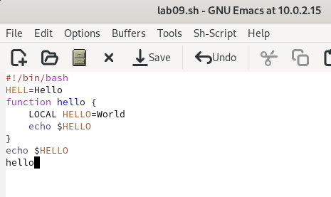

---
## Front matter
lang: ru-RU
title: Текстовый редактор emacs
subtitle: Операционные Системы
author:
  - Барсегян В.Л.
institute:
  - Российский университет дружбы народов, Москва, Россия
date: 28.03.2023г.

## i18n babel
babel-lang: russian
babel-otherlangs: english

## Formatting pdf
toc: false
toc-title: Содержание
slide_level: 2
aspectratio: 169
section-titles: true
theme: metropolis
header-includes:
 - \metroset{progressbar=frametitle,sectionpage=progressbar,numbering=fraction}
 - '\makeatletter'
 - '\beamer@ignorenonframefalse'
 - '\makeatother'
---

# Информация

## Докладчик

  * Барсегян Вардан Левонович
  * НПИбд-01-22
  * Российский университет дружбы народов
  * [1132222005@pfur.ru]
  * <https://github.com/VARdamn/study_2022-2023_os-intro>

# Вводная часть

## Цели и задачи

Познакомиться с операционной системой Linux. Получить практические навыки работы с редактором Emacs.

# Выполнение лабораторной работы

## Запускаю редактор emacs

{#fig:001 width=70%}

## Создаю файл lab09.sh с помощью комбинации C-x C-f

{#fig:002 width=70%}

## Ввожу текст в созданный файл

{#fig:003 width=70%}

## Сохраняю файл с помощью комбинации C-x C-s

{#fig:004 width=70%}

## Вырезаю с помощью команды С-k последнюю строку, вставляю ее обратно в конец файла с помощью комбинации С-у

{#fig:005 width=70%}

## С помощью комбинации C-space выделяю область текста 

{#fig:006 width=70%}

## Копирую выделенный фрагмент в буфер обмена (комбинация M-w) и вставляю в конец файла (комбинация С-y)

{#fig:007 width=70%}

## Выделяю вновь эту область, вырезаю её (комбинация C-w) 

{#fig:008 width=70%}

## Отменяю последнее действие (комбинация C-/) 

{#fig:009 width=70%}

## Перемещаю курсор в начало строки (комбинация C-а)

{#fig:010 width=70%}

## Перемещаю курсор в конец строки (комбинация C-е)

{#fig:011 width=70%}

## Перемещаю курсор в начало буфера (комбинация M-<) 

{#fig:012 width=70%}

## Перемещаю курсор в конец буфера (комбинация M->)

{#fig:013 width=70%}

## Вывожу список активных буферов на экран (Комбинации C-x, C-b)

{#fig:014 width=70%}

## Перемещаюсь во вновь открытое окно (комбинация C-x) со списком открытых буферов
и переключаюсь на другой буфер (буфер shell)

{#fig:015 width=55%}

## Закрываю окно (комбинация С-х 0) 

{#fig:016 width=55%}

## Вновь переключаюсь между буферами, но уже без вывода их списка на экран (Комбинация C-x b)

{#fig:017 width=60%}

## Делю фрейм на 4 части: на два окна по вертикали (комбинация C-x 3), а затем каждое из этих окон на две части по горизонтали (комбинация C-x 2)

{#fig:018 width=60%}

## В каждом из четырёх созданных окон открываю новый буфер (файл) и ввожу несколько строк текста. Переключаюсь в режим поиска (комбинация С-s) и нахожу слова в тексте. Выхожу из режима поиска (комбинация С-g)

{#fig:019 width=50%}

## Перехожу в режим поиска и замены (комбинация М-%) ввожу слово которое надо заменить (слово word)

{#fig:020 width=50%}

## Ввожу текст для замены (new_word), подтверждаю замену. Слово word заменилось на new_word

{#fig:021 width=50%}

## Ввожу другой режим поиска (комбинация M-s o). Он отличается от предыдущего тем, что ищет по регулярному выражению, а не просто строке. Ввожу регулярное выражение для поиска

{#fig:022 width=70%}

## В результате поиска вывелись слова, начинающиеся с заглавной латинской буквы и далее буквами ext 

{#fig:023 width=40%}

## Вывод

Я познакомился с редактором emacs, получил практические навыки по работе с ним, узнал комбинации клавиш для редактирования файлов, перемещения курсора, управления буфером и окнами. Также я узнал о различных режимах поиска в данном редакторе

