---
## Front matter
title: "Лабораторная работа №9"
subtitle: "Текстовый редактор emacs"
author: "Барсегян Вардан Левонович"

## Generic otions
lang: ru-RU
toc-title: "Содержание"

## Bibliography
bibliography: bib/cite.bib
csl: pandoc/csl/gost-r-7-0-5-2008-numeric.csl

## Pdf output format
toc: true # Table of contents
toc-depth: 2
lof: true # List of figures
lot: true # List of tables
fontsize: 12pt
linestretch: 1.5
papersize: a4
documentclass: scrreprt
## I18n polyglossia
polyglossia-lang:
  name: russian
  options:
	- spelling=modern
	- babelshorthands=true
polyglossia-otherlangs:
  name: english
## I18n babel
babel-lang: russian
babel-otherlangs: english
## Fonts
mainfont: PT Serif
romanfont: PT Serif
sansfont: PT Sans
monofont: PT Mono
mainfontoptions: Ligatures=TeX
romanfontoptions: Ligatures=TeX
sansfontoptions: Ligatures=TeX,Scale=MatchLowercase
monofontoptions: Scale=MatchLowercase,Scale=0.9
## Biblatex
biblatex: true
biblio-style: "gost-numeric"
biblatexoptions:
  - parentracker=true
  - backend=biber
  - hyperref=auto
  - language=auto
  - autolang=other*
  - citestyle=gost-numeric
## Pandoc-crossref LaTeX customization
figureTitle: "Рис."
tableTitle: "Таблица"
listingTitle: "Листинг"
lofTitle: "Список иллюстраций"
lotTitle: "Список таблиц"
lolTitle: "Листинги"
## Misc options
indent: true
header-includes:
  - \usepackage{indentfirst}
  - \usepackage{float} # keep figures where there are in the text
  - \floatplacement{figure}{H} # keep figures where there are in the text
---

# Цель работы

Познакомиться с операционной системой Linux. Получить практические навыки работы с редактором Emacs.

# Выполнение лабораторной работы

1. Запускаю редактор emacs (рис. @fig:001).

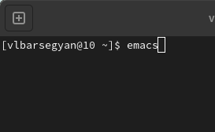{#fig:001 width=70%}

2. Создаю файл lab09.sh с помощью комбинации C-x C-f (рис. @fig:002).

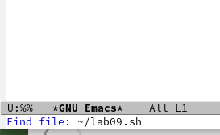{#fig:002 width=70%}

3. Ввожу текст в созданный файл (рис. @fig:003).

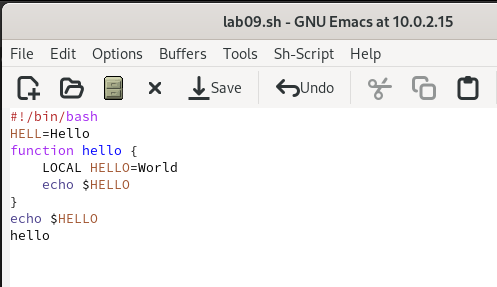{#fig:003 width=70%}

4. Сохраняю файл с помощью комбинации C-x C-s (рис. @fig:004).

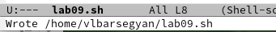{#fig:004 width=70%}

5. Вырезаю с помощью команды С-k последнюю строку, вставляю ее обратно в конец файла с помощью комбинации С-у (рис. @fig:005).

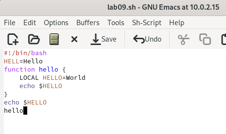{#fig:005 width=70%}

6. С помощью комбинации C-space выделяю область текста (рис. @fig:006).

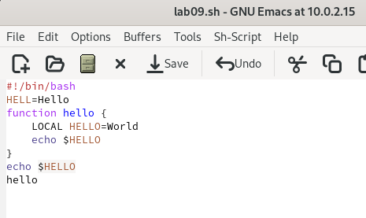{#fig:006 width=70%}

7. Копирую выделенный фрагмент в буфер обмена (комбинация M-w) и вставляю в конец файла (комбинация С-y) (рис. @fig:007).

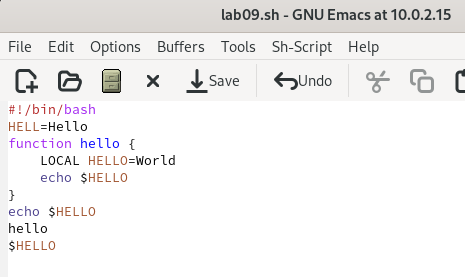{#fig:007 width=70%}

8. Выделяю вновь эту область, вырезаю её (комбинация C-w) (рис. @fig:008).

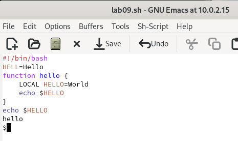{#fig:008 width=70%}

9. Отменяю последнее действие (комбинация C-/) (рис. @fig:009).

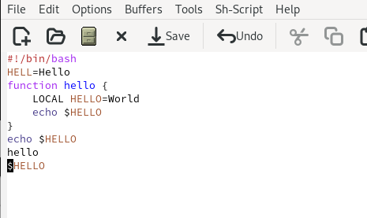{#fig:009 width=70%}

10. Перемещаю курсор в начало строки (комбинация C-а) (рис. @fig:010).

{#fig:010 width=70%}

11. Перемещаю курсор в конец строки (комбинация C-е) (рис. @fig:011).

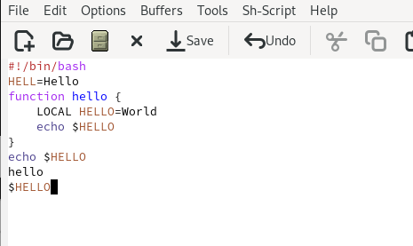{#fig:011 width=70%}

12. Перемещаю курсор в начало буфера (комбинация M-<) (рис. @fig:012).

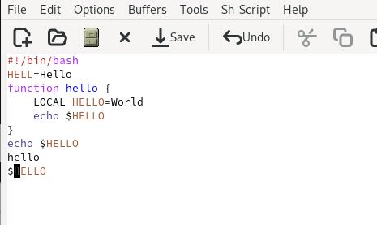{#fig:012 width=70%}

13. Перемещаю курсор в конец буфера (комбинация M->) (рис. @fig:013).

{#fig:013 width=70%}

14. Вывожу список активных буферов на экран (Комбинации C-x, C-b) (рис. @fig:014).

{#fig:014 width=70%}

15. Перемещаюсь во вновь открытое окно (комбинация C-x) со списком открытых буферов
и переключаюсь на другой буфер (буфер shell) (рис. @fig:015).

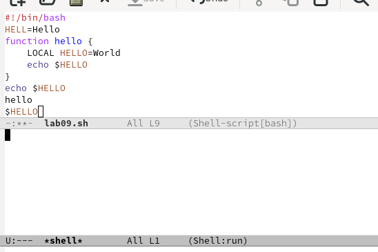{#fig:015 width=70%}

16. Закрываю окно (комбинация С-х 0) (рис. @fig:016).

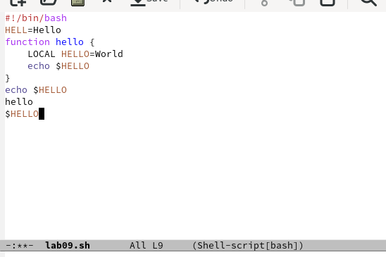{#fig:016 width=70%}

17. Вновь переключаюсь между буферами, но уже без вывода их списка на экран (Комбинация C-x b). (рис. @fig:017).

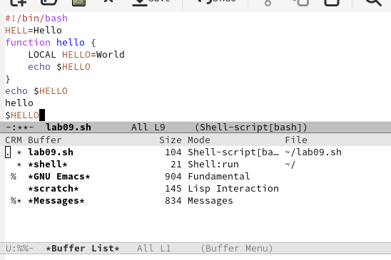{#fig:017 width=70%}

18. Делю фрейм на 4 части: на два окна по вертикали (комбинация C-x 3), а затем каждое из этих окон на две части по горизонтали (комбинация C-x 2) (рис. @fig:018).

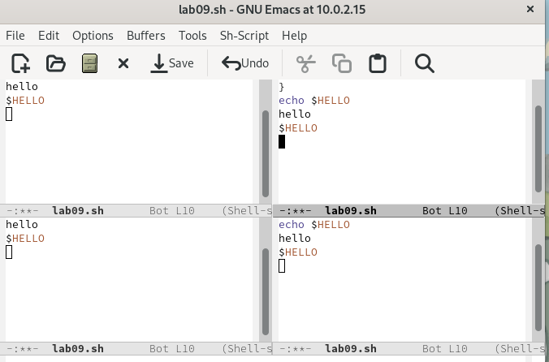{#fig:018 width=70%}

19. В каждом из четырёх созданных окон открываю новый буфер (файл) и ввожу несколько строк текста. Переключаюсь в режим поиска (комбинация С-s) и нахожу слова в тексте. Выхожу из режима поиска (комбинация С-g) (рис. @fig:019).

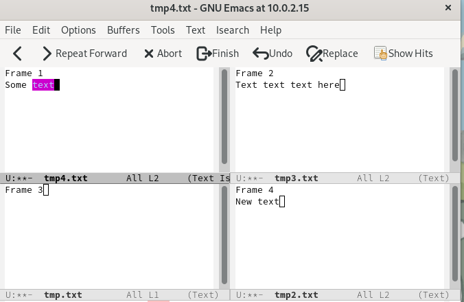{#fig:019 width=70%}

20. Перехожу в режим поиска и замены (комбинация М-%) ввожу слово которое надо заменить (слово word) (рис. @fig:020).

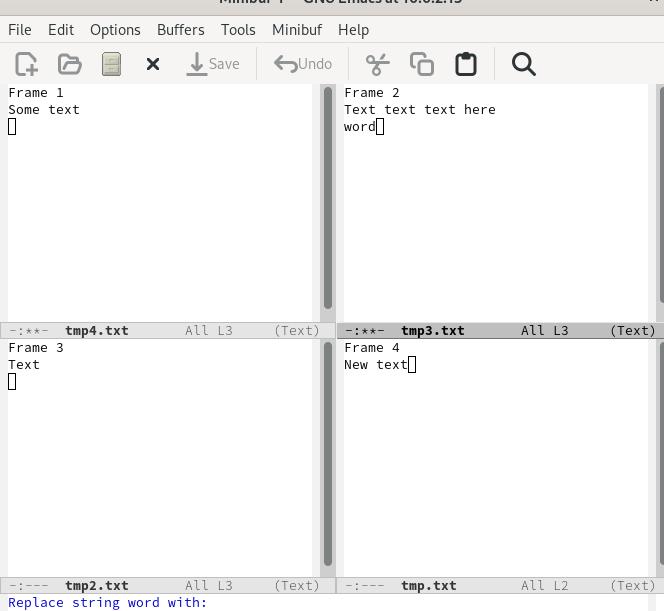{#fig:020 width=70%}

21. Ввожу текст для замены (new_word), подтверждаю замену. Слово word заменилось на new_word (рис. @fig:021).

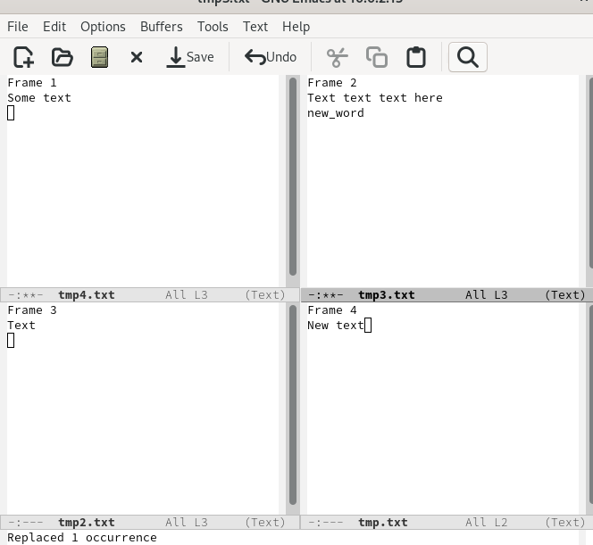{#fig:021 width=70%}

22. Ввожу другой режим поиска (комбинация M-s o). Он отличается от предыдущего тем, что ищет по регулярному выражению, а не просто строке. Ввожу регулярное выражение для поиска (рис. @fig:022).

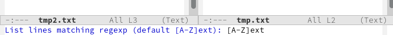{#fig:022 width=70%}

23. В результате поиска вывелись слова, начинающиеся с заглавной латинской буквы и далее буквами ext (рис. @fig:023).

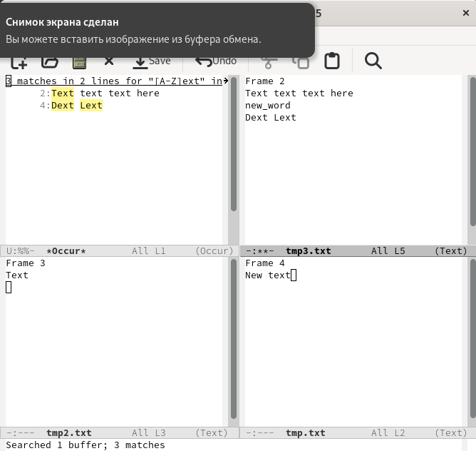{#fig:023 width=70%}

# Выводы

Я познакомился с редактором emacs, получил практические навыки по работе с ним, узнал комбинации клавиш для редактирования файлов, перемещения курсора, управления буфером и окнами. Также я узнал о различных режимах поиска в данном редакторе

# Контрольные вопросы

1. Кратко охарактеризуйте редактор emacs.

Редактор emacs - текстовый экранный редактор текста, имеющий множество различных расширений и широкий базовый функционал. 

2. Какие особенности данного редактора могут сделать его сложным для освоения новичком?

Из-за своеобразной архитектуры, данный текстовый редактор сложен в освоении из-за большого количества различных команд, необычных комбинаций клавиш для действий (например, Ctrl-y для вставки вместо привычного Ctrl-V)

3. Своими словами опишите, что такое буфер и окно в терминологии emacs’а.

Буфер - это такое пространство в открытом редакторе, в котором содержится некая информация (подсказки, логи, открытый файл и т.д.)

Окно - это ограниченная область для отображения буфера

4. Можно ли открыть больше 10 буферов в одном окне?

В одном окне может отображаться только один буфер

5. Какие буферы создаются по умолчанию при запуске emacs?

Открывается буфер GNU Emacs с полезной ознакомительной информацией, информацией о версии emacs

6. Какие клавиши вы нажмёте, чтобы ввести следующую комбинацию C-c | и C-c C-|?

Ctrl+C |, Ctrl+C Ctrl+|

7. Как поделить текущее окно на две части?

Комбинацией С-x 3

8. В каком файле хранятся настройки редактора emacs?

Для настройки Emacs используется специальный файл, который обычно находится в каталоге пользователя и называется .emacs

9. Какую функцию выполняет клавиша <- и можно ли её переназначить?

Стрелка <- перемещает курсор влево, а в сочетаниии с клавишей Ctrl перемещает курсор влево до следующего слова. 

Клавиша Backspace удаляет символ, а в сочетаниии с клавишей Ctrl удаляет полностью слово

В Emacs доступно переназначение клавиш

10. Какой редактор вам показался удобнее в работе vi или emacs? Поясните почему.

Удобнее однозначно показался vi, т.к. при первом знакомстве он показался проще в освоении и интуитивно понятнее
