---
## Front matter
lang: ru-RU
title: Лабораторная Работа №10. Программирование в командном процессоре ОС UNIX. Командные файлы
subtitle: Операционные системы
author:
  - Барсегян В.Л.
institute:
  - Российский университет дружбы народов, Москва, Россия

## i18n babel
babel-lang: russian
babel-otherlangs: english

## Formatting pdf
toc: false
toc-title: Содержание
slide_level: 2
aspectratio: 169
section-titles: true
theme: metropolis
header-includes:
 - \metroset{progressbar=frametitle,sectionpage=progressbar,numbering=fraction}
 - '\makeatletter'
 - '\beamer@ignorenonframefalse'
 - '\makeatother'
---

## Докладчик

  * Барсегян Вардан Левонович
  * НПИбд-01-22
  * Российский университет дружбы народов
  * [1132222005@pfur.ru]
  * <https://github.com/VARdamn/study_2022-2023_os-intro>
  
# Вводная часть

## Цели и задачи

Изучить основы программирования в оболочке ОС UNIX/Linux. Научиться писать
небольшие командные файлы.

# Выполнение лабораторной работы

## Создаю папку backup для резервного копирования, создаю файла для первого скрипта и открываю его

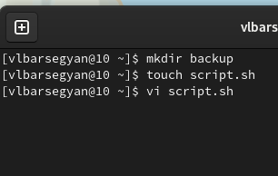{#fig:001 width=70%}

## С помощью команды man изучаю опции и использование архиватора tar

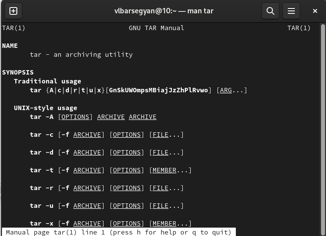{#fig:002 width=60%}

## Код первого скрипта 

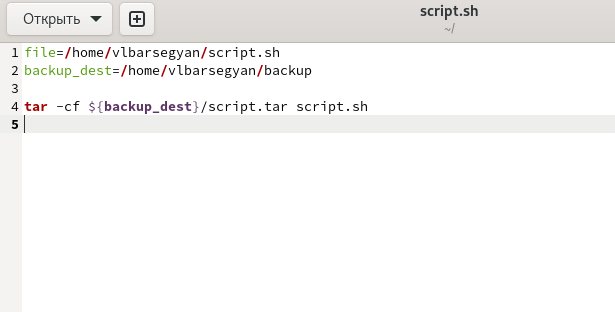{#fig:003 width=70%}

## Запускаю скрипт и проверяю его работу - в папке backup создался архив с файлом этого скрипта

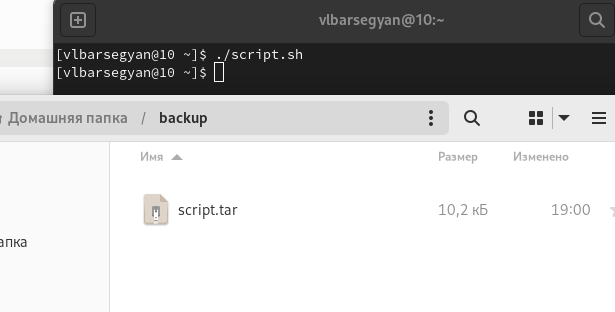{#fig:004 width=70%}

## Создаю файл для второго скрипта, делаю файл исполняемым, запускаю в редакторе

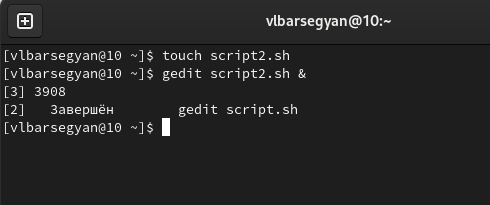{#fig:005 width=70%}

## Код второго скрипта

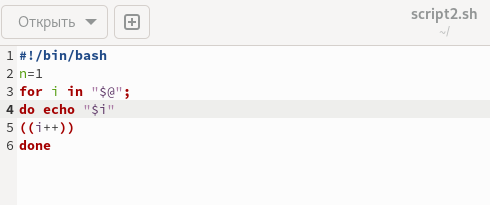{#fig:006 width=70%}

## Проверка работы второго скрипта

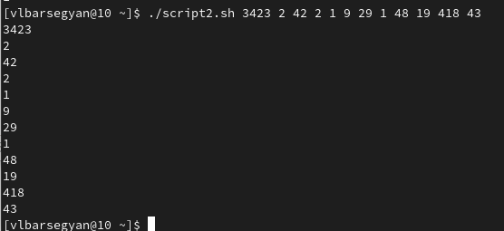{#fig:007 width=70%}

## Создаю файл для третьего скрипта, делаю файл исполняемым, запускаю в редакторе

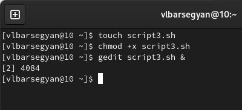{#fig:008 width=70%}

## Код третьего скрипта

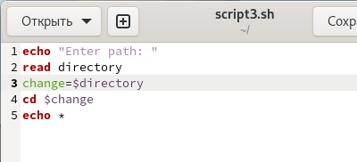{#fig:009 width=70%}

## Проверка работы третьего скрипта

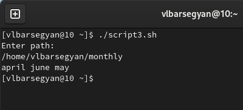{#fig:010 width=70%}

## Создаю файл для четвертого скрипта, делаю файл исполняемым, запускаю в редакторе

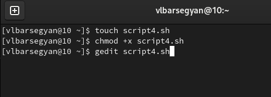{#fig:011 width=70%}

## Код четвертого скрипта 

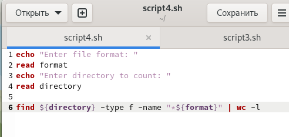{#fig:012 width=70%}

## Проверка работы четвертого скрипта

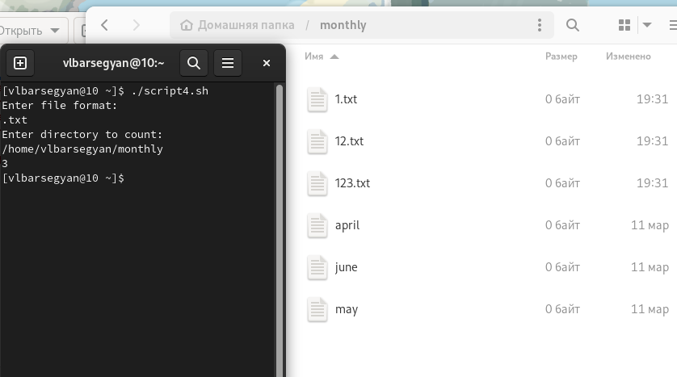{#fig:013 width=60%}

## Вывод

Я изучил основы программирования в оболочке ОС UNIX/Linux, узнал множество различных команд, узнал про циклы, ветвления и прочие конструкции. Написал 4 скрипта (командные файлы)
