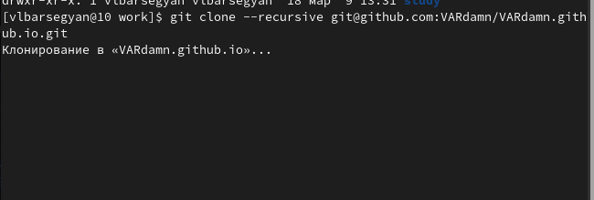

---
## Front matter
lang: ru-RU
title: Индивидуальный проект
subtitle: Операционные системы
author:
  - Барсегян В.Л.
institute:
  - Российский университет дружбы народов, Москва, Россия

## i18n babel
babel-lang: russian
babel-otherlangs: english

## Formatting pdf
toc: false
toc-title: Содержание
slide_level: 2
aspectratio: 169
section-titles: true
theme: metropolis
header-includes:
 - \metroset{progressbar=frametitle,sectionpage=progressbar,numbering=fraction}
 - '\makeatletter'
 - '\beamer@ignorenonframefalse'
 - '\makeatother'
---

## Докладчик

  * Барсегян Вардан Левонович
  * НПИбд-01-22
  * Российский университет дружбы народов
  * [1132222005@pfur.ru]
  * <https://github.com/VARdamn/study_2022-2023_os-intro>
  
# Вводная часть

## Цели и задачи

Создание шаблона сайта и выгрузка шаблона на Github, работа с шаблоном Hugo. 

# Выполнение лабораторной работы

## Клонирование репозитория 

Создаю репозиторий на Github, перехожу в папку work и клонирую созданный репозиторий

{#fig:001 width=60%}

## Проверка файлов

Перехожу в папку клонированного репозитория, проверяю наличие файлов

{#fig:002 width=60%}

## Выполнение команды

Выполняю команду ~/bin/hugo

{#fig:003 width=60%}

## Выполнение команды для локального запуска шаблона

Выполняю команду ~/bin/hugo/server, запуская на локальной машине шаблон сайта

{#fig:004 width=60%}

## Шаблон сайта

Открываю созданный шаблон, запущенный на локальном сервере

{#fig:005 width=60%}

## Создание и клонирование нового шаблона

Создаю репозиторий VARdamn.github.io, клонирую его

{#fig:006 width=60%} 

## Переключение на ветку main

Сoздаю и переключаюсь на ветку main

{#fig:007 width=60%}

## Создание файла и его выгрузка на репозиторий

Создаю файл README.md, загружаю его в последний созданный репозиторий

{#fig:008 width=60%}

## Вводы команды

Ввожу команду git submodule

{#fig:009 width=60%}

## Команда ~/bin/hugo

Прописываю команду ~/bin/hugo, генерируя файлы сайта

{#fig:010 width=60%}

## Коммит созданных файлов в репозиторий

Перехожу в папку public, коммичу созданные файлы в репозиторий

{#fig:011 width=60%}

## Проверка коммита 

Проверяю сделанный коммит - все файлы выгружены в репозиторий.

{#fig:012 width=50%}

## Вывод

Я узнал про шаблон для создания сайтов Hugo, создал два репозитория для создания собственного сайта по данному шаблону, выгрузил шаблон на Github.
