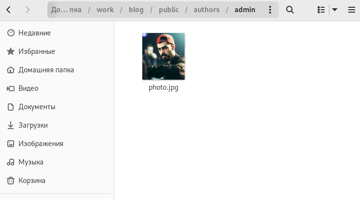
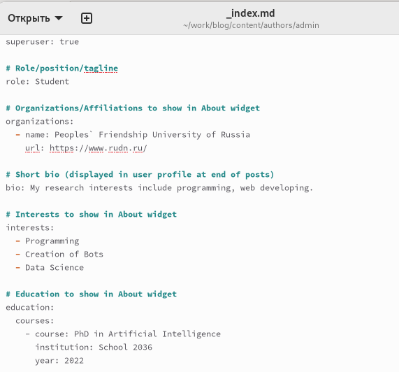
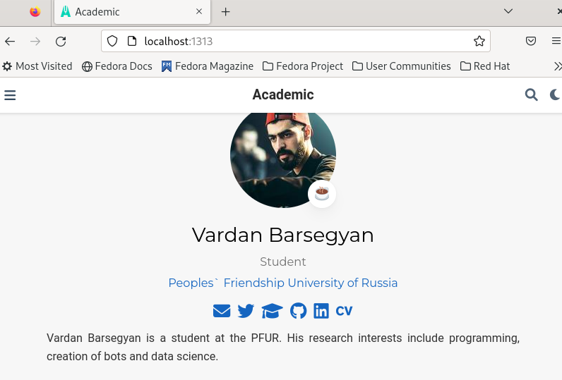
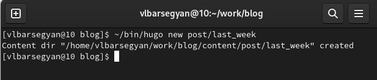
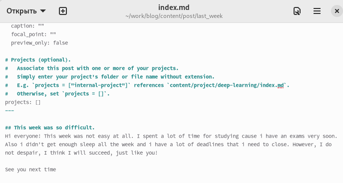
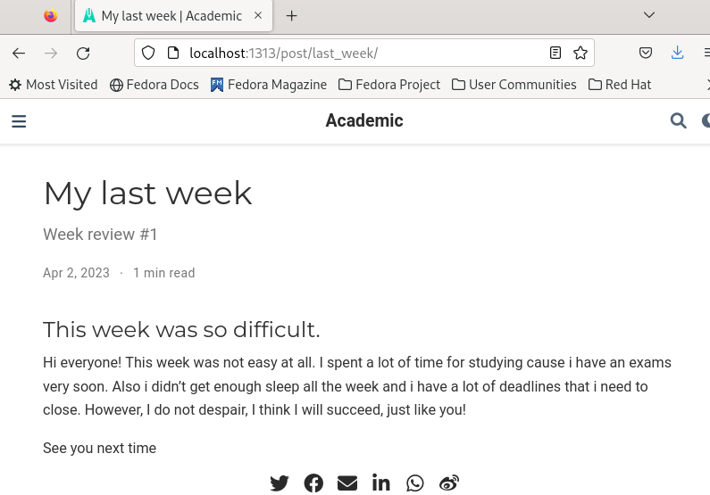
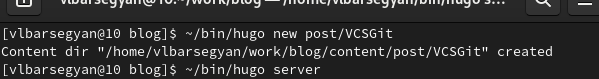
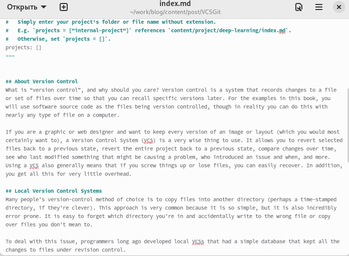
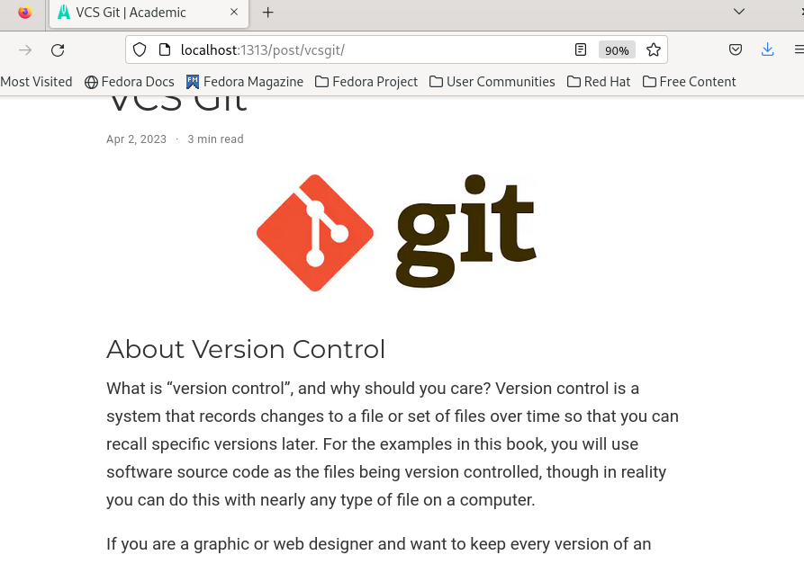

---
## Front matter
lang: ru-RU
title: Индивидуальный проект. Этап 2
subtitle: Операционные системы
author:
  - Барсегян В.Л.
institute:
  - Российский университет дружбы народов, Москва, Россия

## i18n babel
babel-lang: russian
babel-otherlangs: english

## Formatting pdf
toc: false
toc-title: Содержание
slide_level: 2
aspectratio: 169
section-titles: true
theme: metropolis
header-includes:
 - \metroset{progressbar=frametitle,sectionpage=progressbar,numbering=fraction}
 - '\makeatletter'
 - '\beamer@ignorenonframefalse'
 - '\makeatother'
---

## Докладчик

  * Барсегян Вардан Левонович
  * НПИбд-01-22
  * Российский университет дружбы народов
  * [1132222005@pfur.ru]
  * <https://github.com/VARdamn/study_2022-2023_os-intro>
  
# Вводная часть

## Цели и задачи

Научиться добавлять на сайт различные данные: данные о себе, посты, картинки.

# Выполнение лабораторной работы

## Копирую в папку ~/work/blog/public/authors/admin новую аватарку. 

{#fig:001 width=55%}

## Редактирую информацию о себе: краткое описание, информация об интересах и об образовании

{#fig:002 width=40%}

## Запускаю сайт на локальной машине командой ~/bin/hugo server и проверяю результат

{#fig:003 width=55%}

## Создаю новый пост о прошедшей неделе командой ~/bin/hugo new post/last_week

{#fig:004 width=55%}

## Редактирую md-файл для этого поста

{#fig:005 width=55%}

## Запускаю сайт и проверяю созданный пост

{#fig:006 width=55%}

## Создаю еще один пост о системе контроля версий Git 

{#fig:007 width=55%}

## Редактирую содержимое поста: добавляю информацию, также добавляю картинку для поста 

{#fig:008 width=45%}

## Проверяю созданный пост о системе контроля версий 

{#fig:009 width=55%}

## Вывод

Я научился редактировать информацию о себе, узнал как создавать и редактировать посты, картинки к ним
