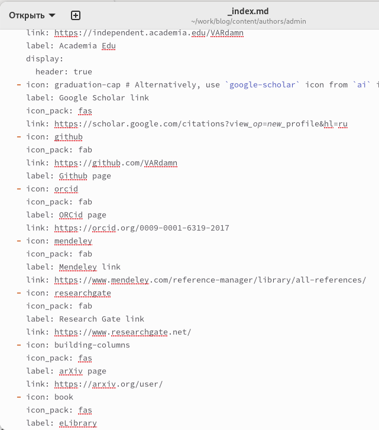
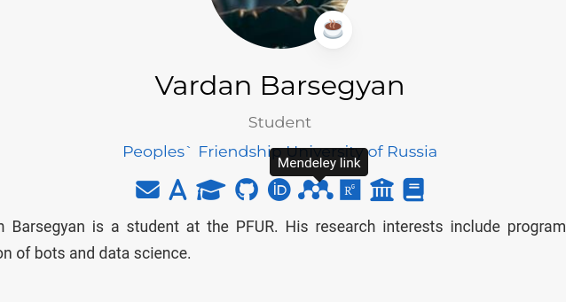
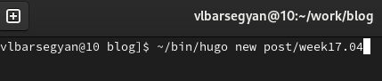
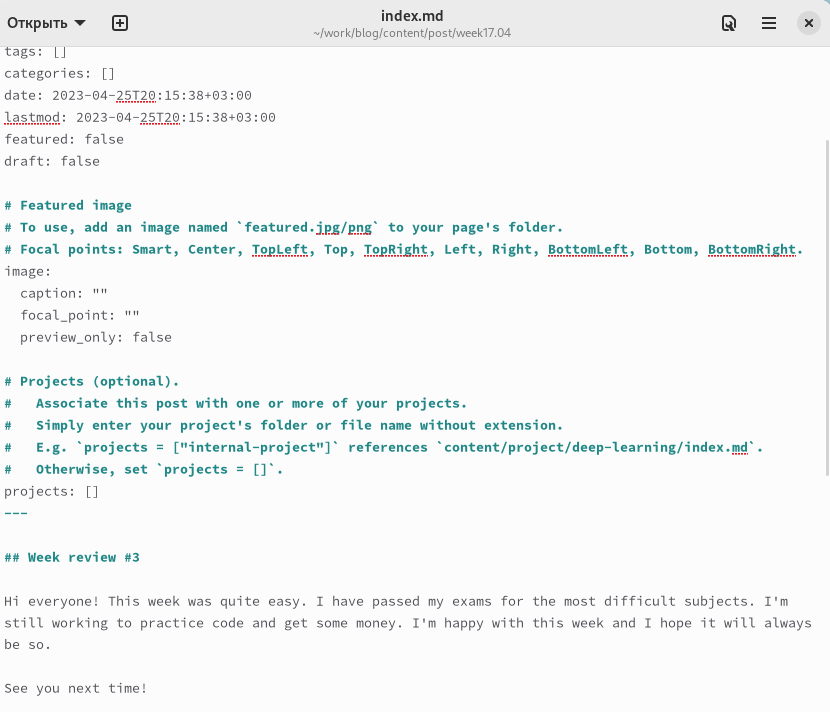
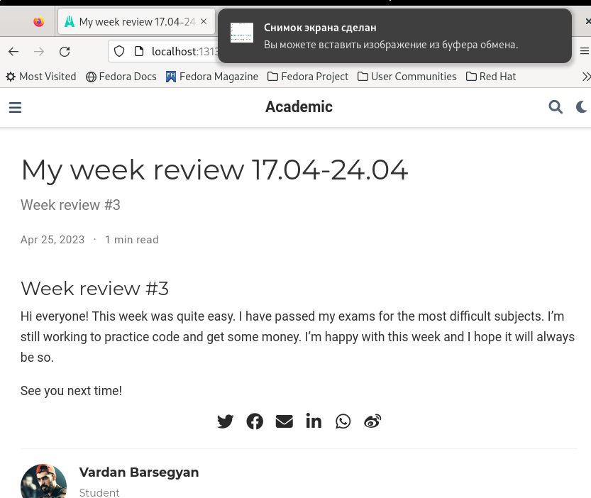
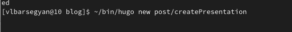
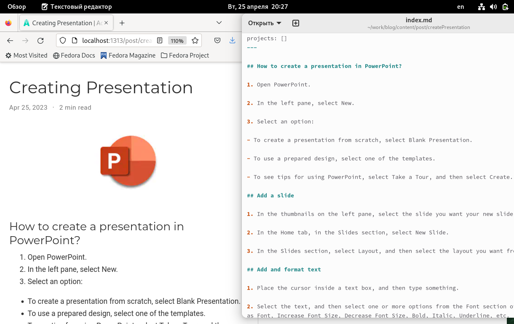

---
## Front matter
lang: ru-RU
title: Индивидуальный проект. Этап 4
subtitle: Операционные системы
author:
  - Барсегян В.Л.
institute:
  - Российский университет дружбы народов, Москва, Россия

## i18n babel
babel-lang: russian
babel-otherlangs: english

## Formatting pdf
toc: false
toc-title: Содержание
slide_level: 2
aspectratio: 169
section-titles: true
theme: metropolis
header-includes:
 - \metroset{progressbar=frametitle,sectionpage=progressbar,numbering=fraction}
 - '\makeatletter'
 - '\beamer@ignorenonframefalse'
 - '\makeatother'
---

## Докладчик

  * Барсегян Вардан Левонович
  * НПИбд-01-22
  * Российский университет дружбы народов
  * [1132222005@pfur.ru]
  * <https://github.com/VARdamn/study_2022-2023_os-intro>
  
# Вводная часть

## Цели и задачи

Добавить ссылки на профили в 8 различных сайтах, сделать пост о прошедшей неделе, сделать пост на тему по выбору (создание презентации).

# Выполнение лабораторной работы

## Добавляю ссылки на профили в различных сайтах в файле ~/work/blog/content/authors/admin/index.md.

{#fig:001 width=35%}

## Получаю следующий результат

{#fig:002 width=70%}

## Создаю новый пост по прошедшей неделе командой ~bin/hugo/server new post/week17.04

{#fig:003 width=70%}

## Пишу пост

{#fig:004 width=45%}

## Запускаю сайт на локальной машине и проверяю написанный пост

{#fig:005 width=45%}

## Создаю новый пост на тему "Создание презентации" командой ~/bin/hugo new post/createPresentation

{#fig:006 width=70%}

## Пишу пост, проверяю результат

{#fig:007 width=70%}

## Вывод

Я добавил ссылки на свои профили на различных сайтах, написал пост по прошедшей неделе, также я написал пост о создании презентаций.

